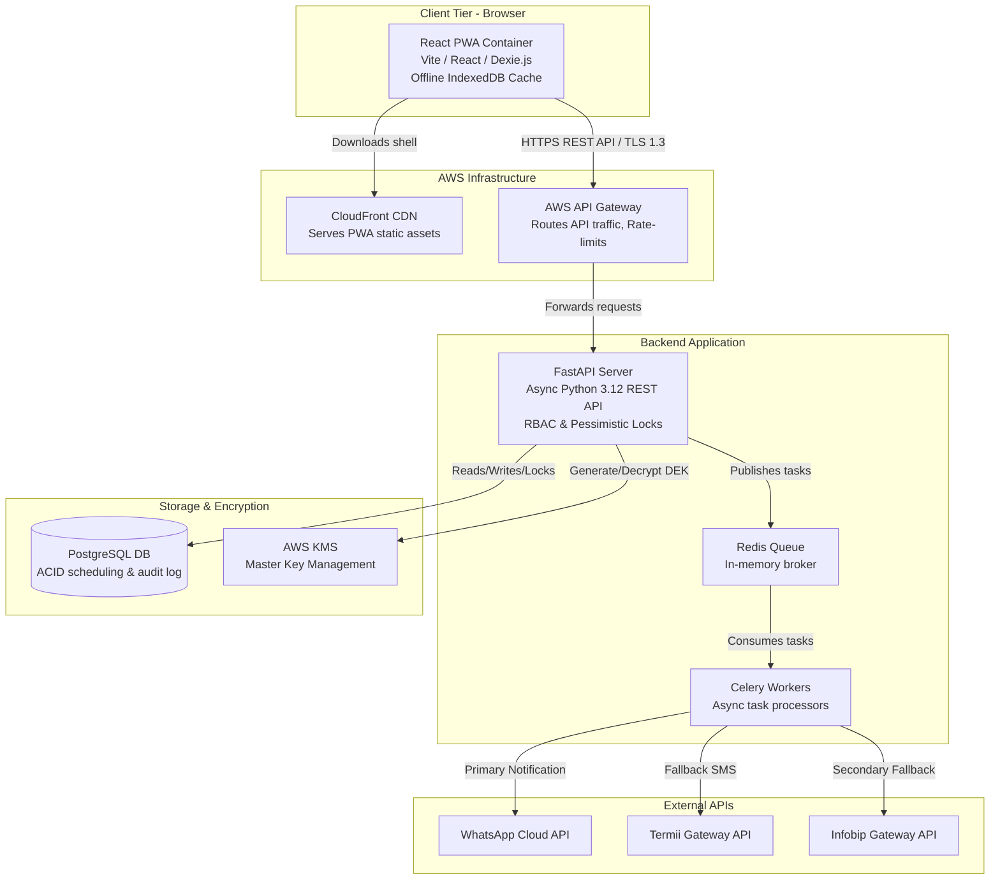
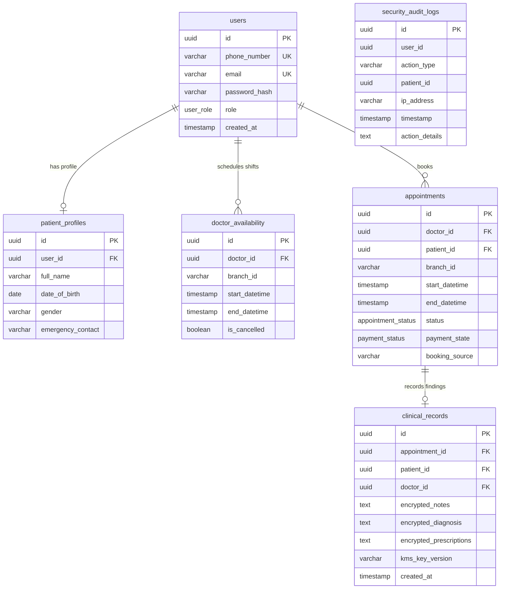

# Clinic Modernization Platform (CMP) — Implementation Plan

**Document Owner:** Principal Software Architect  
**Target Audience:** Engineering Leads, Full-Stack Developers, DevOps Engineers, Coding Agents  
**Status:** Approved for Execution  

---

## 1. High-Level System Architecture and Component Boundaries

The Clinic Modernization Platform (CMP) is architected as a decoupled, cloud-native system prioritizing data security, transactional integrity, and offline resiliency. 

### 1.1 Component Boundaries
1. **Client Tier (Frontend PWA)**: A Single Page Application (SPA) built with **React and Vite**. It utilizes **Workbox** for Service Worker management and **Dexie.js** (IndexedDB) to cache the daily schedule, satisfying the 2-hour offline read-only requirement (NFR-004). Hosted statically on AWS S3 and distributed via Amazon CloudFront.
2. **API Tier (Backend)**: An asynchronous **FastAPI** (Python 3.12) application. It handles routing, Role-Based Access Control (RBAC), and business logic. It acts as the orchestrator for database transactions and cryptographic operations.
3. **Data Tier (Database)**: A managed **PostgreSQL 16+** instance (AWS RDS). It enforces relational integrity and utilizes pessimistic row-level locking (`SELECT ... FOR UPDATE`) to prevent concurrent booking race conditions.
4. **Security Tier (Cryptography)**: **AWS KMS** manages the Master Keys. The backend uses Envelope Encryption (AES-256-GCM) to encrypt clinical records at the application layer before database insertion.
5. **Background Processing Tier (Async Workers)**: A **Redis** message broker paired with **Celery** workers handles out-of-band tasks, specifically the pluggable notification failover chain (WhatsApp → Termii SMS → Infobip SMS).

### 1.2 Container Architecture Diagram

---

## 2. Core Data Models and Database Schemas

The database schema is designed for strict normalization, auditability, and future-proofing (e.g., Phase 2 payment states). We use **SQLAlchemy** (or SQLModel) as the ORM.

### 2.1 Entity-Relationship Diagram

### 2.2 Critical Schema Constraints
* **Application-Level Encryption**: The `clinical_records` table stores `encrypted_notes`, `encrypted_diagnosis`, and `encrypted_prescriptions` as `TEXT` (Ciphertext + IV + Auth Tag). Plaintext is *never* stored in the database.
* **Immutable Audit Trail**: The `security_audit_logs` table is append-only. Any `INSERT` or `SELECT` on `clinical_records` must trigger a corresponding `INSERT` into the audit log within the same database transaction.
* **Time-Bound Shifts**: `doctor_availability` uses `start_datetime` and `end_datetime` to allow doctors to rotate between branches on the same day.

---

## 3. API Contracts and Inter-Service Protocols

### 3.1 REST API Design (FastAPI)
All client-server communication occurs over HTTPS (TLS 1.3) using JSON payloads. Authentication is handled via **JWT (JSON Web Tokens)** passed in the `Authorization: Bearer <token>` header.

#### Key Endpoints:
1. **Authentication & OTP**
   * `POST /api/v1/auth/verify-request`: Initiates the WhatsApp/SMS OTP flow.
   * `POST /api/v1/auth/verify-submit`: Validates OTP and returns JWT.
2. **Scheduling Engine**
   * `GET /api/v1/availability?branch_id={id}&date={date}`: Returns available slots.
   * `POST /api/v1/appointments`: Creates a booking. Executes pessimistic lock.
   * `PATCH /api/v1/appointments/{id}/cancel`: Cancels booking, triggers penalty tier evaluation logic.
3. **Clinical Records**
   * `POST /api/v1/clinical-records`: Submits consultation notes (triggers KMS encryption).
   * `GET /api/v1/clinical-records/patient/{id}`: Retrieves patient history (triggers KMS decryption and audit log).

### 3.2 Inter-Service Communication (Async Workers)
The FastAPI backend communicates with Celery workers via **Redis**.
* **Protocol**: Redis Pub/Sub and List structures (managed by Celery).
* **Payload**: JSON serialized task arguments.
* **Example Task**: `send_notification_task(user_id, template_id, context)`
  * Worker attempts WhatsApp API.
  * On `Timeout` or `4xx/5xx`, worker catches exception and immediately invokes `send_termii_sms_task`.

---

## 4. Phased Implementation Strategy

The project will be executed in 5 phases over a 16-week timeline to meet the 4-month MVP constraint.

### Phase 1: Infrastructure & Scaffolding (Weeks 1-2)
* **Goal**: Establish cloud environments, CI/CD pipelines, and base repositories.
* **Steps**:
  1. Provision AWS infrastructure via Terraform (VPC, RDS PostgreSQL, ElastiCache Redis, S3, CloudFront, KMS).
  2. Initialize the FastAPI backend repository with Alembic for database migrations.
  3. Initialize the React + Vite PWA frontend repository.
  4. Setup GitHub Actions for automated testing and deployment.

### Phase 2: Backend Core & Database (Weeks 3-6)
* **Goal**: Implement the core domain logic, scheduling engine, and security layers.
* **Steps**:
  1. **Data Layer**: Define SQLAlchemy models and run initial Alembic migrations.
  2. **Auth & RBAC**: Implement JWT authentication and role-based route dependencies.
  3. **Scheduling Engine**: Implement `POST /appointments` with `with_for_update()` pessimistic locking. Implement the 90-day rolling penalty tier logic (Tier 1, 2, 3) for cancellations.
  4. **Cryptography**: Integrate `boto3` for AWS KMS. Build the SQLAlchemy custom types or service layer functions to handle AES-256-GCM envelope encryption/decryption for clinical records.
  5. **Audit Logging**: Implement database event listeners or service-layer wrappers to guarantee audit log insertion on clinical data access.

### Phase 3: Frontend PWA & Offline Sync (Weeks 7-10)
* **Goal**: Build the responsive UI and implement offline capabilities.
* **Steps**:
  1. **UI Components**: Build mobile-first views for Patients (Booking) and desktop views for Receptionists/Doctors using TailwindCSS.
  2. **API Integration**: Connect frontend to FastAPI endpoints using Axios or React Query.
  3. **PWA Configuration**: Configure `vite-plugin-pwa` to generate the Web App Manifest and Service Workers.
  4. **Offline Caching**: Implement Dexie.js. Create a sync function that downloads the current day's appointments on login/refresh. Intercept network failures to serve read-only Dexie.js data with an "Offline Mode" UI banner.

### Phase 4: Integrations & Async Workers (Weeks 11-13)
* **Goal**: Implement the pluggable notification system and OTP flows.
* **Steps**:
  1. **Worker Setup**: Configure Celery with Redis broker.
  2. **Strategy Pattern**: Implement the `NotificationService` interface and concrete classes (`WhatsAppClient`, `TermiiClient`, `InfobipClient`).
  3. **Failover Logic**: Write the Celery task chain that attempts WhatsApp -> Termii -> Infobip based on timeouts/errors.
  4. **OTP Engine**: Implement the channel-agnostic OTP generation and validation logic.

### Phase 5: Testing, UAT, & Deployment (Weeks 14-16)
* **Goal**: Ensure system stability, security, and performance before pilot rollout.
* **Steps**:
  1. **Load Testing**: Use Locust/k6 to simulate 100 concurrent users booking the same doctor slot to verify pessimistic locking and sub-2.0s search latency.
  2. **Security Audit**: Verify KMS IAM policies. Ensure DB admins cannot read plaintext clinical notes.
  3. **Pilot Rollout**: Deploy to production. Onboard Branch A (Pilot). Monitor Datadog/CloudWatch logs for anomalies.

---

## 5. Critical Technical Decisions, Trade-offs, & Constraints

### 5.1 Pessimistic Locking vs. Optimistic Locking
* **Decision**: We are using **Pessimistic Locking** (`SELECT ... FOR UPDATE`) at the database level (ADR-001).
* **Trade-off**: Pessimistic locking can cause database contention and reduce write throughput compared to optimistic locking.
* **Mitigation**: Locks are strictly scoped to narrow time-blocks (the specific doctor's shift and overlapping appointments) and transactions are kept extremely short. This guarantees zero double-bookings (FR-019) without locking the entire table.

### 5.2 Application-Level Encryption vs. Transparent Data Encryption (TDE)
* **Decision**: **Application-Level Column Encryption** using AWS KMS (ADR-003).
* **Trade-off**: Encrypted columns (`encrypted_notes`, `encrypted_diagnosis`) cannot be searched using SQL `LIKE` or full-text search.
* **Mitigation**: Search functionality is restricted to unencrypted metadata (Patient Name, Date, Doctor). This is an acceptable trade-off to achieve absolute NDPR compliance and satisfy NFR-008 (preventing DB admins from reading clinical data).

### 5.3 PWA + IndexedDB vs. Native Mobile Apps
* **Decision**: **React PWA with Dexie.js** (ADR-002).
* **Trade-off**: PWAs lack presence in iOS/Android App Stores and have limited access to deep native device APIs.
* **Mitigation**: The primary constraint is Nigerian network instability and local power outages (NFR-004). A PWA allows us to cache the application shell via Service Workers and store the daily schedule in IndexedDB, providing seamless read-only offline access for clinic staff without the overhead of maintaining three separate codebases (Web, iOS, Android) within a 4-month MVP budget.

### 5.4 Pluggable Notification Failover
* **Decision**: **Strategy Pattern with Celery/Redis** (ADR-004).
* **Trade-off**: Increases backend complexity compared to using a single global provider like Twilio.
* **Mitigation**: Nigerian telecom DND (Do-Not-Disturb) rules block standard transactional SMS. Using Termii as a local primary SMS provider is mandatory for reliability. The failover chain (WhatsApp -> Termii -> Infobip) optimizes for cost (WhatsApp is cheaper) while guaranteeing near 100% delivery rates for critical OTPs and booking reminders.