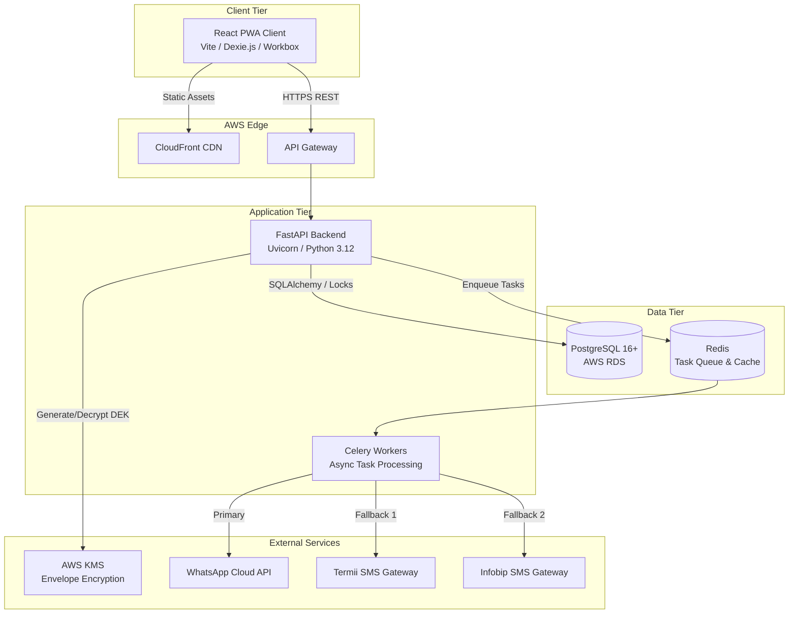

# Implementation Plan: Clinic Modernization Platform (CMP)

**Document Status:** Approved  
**Target Audience:** Engineering Leads, Full-Stack Developers, DevOps Engineers, QA Automation Engineers  
**Objective:** Provide an exhaustive, actionable blueprint for coding agents and human engineers to build, test, and deploy the Phase 1 MVP of the Clinic Modernization Platform within the 4-month timeline.

---

## 1. High-Level System Architecture & Component Boundaries

The CMP is architected as a decoupled, cloud-native system prioritizing offline resilience, transactional integrity, and strict data privacy. 

### 1.1 Architectural Tiers
1. **Client Tier (Edge/Browser)**: A Progressive Web App (PWA) built with **Vite + React**. It utilizes **Workbox** for Service Worker asset caching and **Dexie.js** (IndexedDB) for local read-only data storage to survive 2-hour local internet outages (NFR-004). Hosted statically on **AWS S3** and served via **Amazon CloudFront**.
2. **API Gateway Tier**: **AWS API Gateway** handles rate-limiting, TLS 1.3 termination, and routes RESTful traffic to the backend.
3. **Application Tier**: An asynchronous **FastAPI (Python 3.12)** backend running in containerized environments (e.g., AWS ECS/Fargate). It handles RBAC, business logic, and cryptographic operations.
4. **Data & Storage Tier**: A managed **PostgreSQL 16+** instance (AWS RDS) acting as the primary ACID-compliant datastore.
5. **Background Processing Tier**: **Redis** acts as a message broker for **Celery** workers, which handle asynchronous tasks like the pluggable notification failover chain.
6. **External Integrations**: AWS KMS (Key Management Service), WhatsApp Business Cloud API, Termii SMS, and Infobip SMS.

### 1.2 Container Architecture Diagram



---

## 2. Core Data Models & Database Schemas

The system uses **PostgreSQL** to enforce relational integrity and utilize pessimistic locking (`SELECT ... FOR UPDATE`) to prevent concurrent booking race conditions (FR-019).

### 2.1 Schema Definitions (SQLAlchemy / SQLModel)

*   **`users`**: Base authentication table.
    *   *Columns*: `id` (UUID), `phone_number` (Unique), `email` (Unique), `password_hash`, `role` (Enum), `created_at`.
*   **`patient_profiles`**: NDPR-protected PII.
    *   *Columns*: `id`, `user_id` (FK), `full_name`, `date_of_birth`, `gender`, `emergency_contact`.
*   **`doctor_availability`**: Time-bound shift blocks (FR-018).
    *   *Columns*: `id`, `doctor_id` (FK), `branch_id`, `start_datetime`, `end_datetime`, `is_cancelled`.
*   **`appointments`**: Core scheduling entity.
    *   *Columns*: `id`, `doctor_id` (FK), `patient_id` (FK), `branch_id`, `start_datetime`, `end_datetime`, `status` (Enum), `payment_state` (Enum - INT-005), `booking_source`.
*   **`clinical_records`**: Highly restricted medical data (NFR-008).
    *   *Columns*: `id`, `appointment_id` (FK), `patient_id` (FK), `doctor_id` (FK), `encrypted_notes` (Text), `encrypted_diagnosis` (Text), `encrypted_prescriptions` (Text), `kms_key_version`.
*   **`security_audit_logs`**: Immutable tracking (NFR-007).
    *   *Columns*: `id`, `user_id`, `action_type`, `patient_id`, `ip_address`, `timestamp`, `action_details`.
*   **`verification_otps`**: Channel-agnostic OTP tracking.
    *   *Columns*: `id`, `phone_number`, `hashed_otp`, `attempts`, `is_used`, `expires_at`, `delivery_channel`.

### 2.2 Concurrency & Locking Strategy
To satisfy **FR-019**, the backend must implement explicit row-level locking during the booking flow:
```python
# SQLAlchemy Implementation Example
shift = await session.execute(
    select(DoctorAvailability)
    .where(...)
    .with_for_update() # Acquires pessimistic lock
)
```

---

## 3. API Contracts & Inter-Service Communication

The backend exposes a RESTful JSON API. All endpoints must be prefixed with `/api/v1/`.

### 3.1 Key REST Endpoints

| Endpoint | Method | Auth Role | Description |
| :--- | :--- | :--- | :--- |
| `/auth/verify-request` | `POST` | Public | Initiates WhatsApp/SMS OTP flow. |
| `/auth/login` | `POST` | Public | Returns JWT Access & Refresh tokens. |
| `/appointments` | `POST` | Patient, Staff | Books an appointment. Triggers DB locks. |
| `/appointments/{id}/cancel` | `PATCH` | Patient, Staff | Cancels appointment. Triggers penalty engine. |
| `/clinical-records` | `POST` | Doctor | Encrypts and saves clinical notes. |
| `/clinical-records/patient/{id}`| `GET` | Doctor | Decrypts and retrieves patient history. |
| `/reports/daily` | `GET` | Manager, Admin | Returns branch utilization metrics. |

### 3.2 Inter-Service Communication (Notification Failover)
Communication between the FastAPI web nodes and Celery background workers occurs via **Redis**. 
The system implements a **Strategy Pattern** for notifications (INT-004):
1. FastAPI enqueues a generic `NotificationTask`.
2. Celery worker picks up the task and attempts `WhatsAppCloudAPIClient.send()`.
3. If timeout (>15s) or failure, worker catches the exception and executes `TermiiSMSClient.send()`.
4. If Termii fails, worker executes `InfobipSMSClient.send()`.

---

## 4. Security Policies, Threat Models & Auth Strategies

### 4.1 Authentication & Authorization (RBAC)
*   **Strategy**: Stateless JWT (JSON Web Tokens) with short expiration (15 minutes) and HTTP-only secure refresh tokens (7 days).
*   **RBAC**: Enforced via FastAPI `Security` dependencies (e.g., `Depends(RoleChecker(["doctor", "admin"]))`).

### 4.2 Application-Level Column Encryption (ADR-003)
To satisfy **NFR-008** (DB Admins cannot read clinical data) and **NFR-006** (AES-256 Encryption):
1. **Envelope Encryption**: FastAPI requests a Data Encryption Key (DEK) from AWS KMS.
2. **Encryption**: FastAPI encrypts `notes`, `diagnosis`, and `prescriptions` in memory using AES-256-GCM.
3. **Storage**: Only the ciphertext, Initialization Vector (IV), Auth Tag, and `kms_key_version` are stored in PostgreSQL.
4. **IAM Isolation**: The AWS IAM role attached to the database administrators explicitly denies `kms:Decrypt` actions.

### 4.3 Threat Model Mitigations
*   **Threat**: Database Dump Leak.
    *   *Mitigation*: Clinical records are ciphertext. Passwords are Argon2 hashed. OTPs are hashed.
*   **Threat**: SMS Toll Fraud / OTP Spam.
    *   *Mitigation*: Redis-backed rate limiting (max 3 requests / 15 mins per IP/Phone).
*   **Threat**: Concurrent Booking Race Condition.
    *   *Mitigation*: PostgreSQL `SELECT ... FOR UPDATE` locks.
*   **Threat**: Insider Threat (Unauthorized Record Access).
    *   *Mitigation*: Immutable `security_audit_logs` written in the same DB transaction as any read/write to `clinical_records`.

---

## 5. Phased Implementation Strategy

### Phase 1: Infrastructure & Foundation (Weeks 1-2)
*   **DevOps**: Provision AWS VPC, RDS (PostgreSQL), ElastiCache (Redis), KMS Keys, and S3/CloudFront distributions via Terraform/Pulumi.
*   **Backend**: Scaffold FastAPI project, configure SQLAlchemy/Alembic, and establish CI/CD pipelines (GitHub Actions).
*   **Database**: Create initial schema migrations for `users`, `patient_profiles`, and `verification_otps`.

### Phase 2: Core Backend & Security (Weeks 3-6)
*   **Auth**: Implement JWT authentication, RBAC middleware, and the OTP Generation Engine.
*   **Scheduling Engine**: Build `appointments` and `doctor_availability` schemas. Implement the pessimistic locking logic for concurrent bookings.
*   **Penalty Engine**: Implement the rolling 90-day cancellation penalty logic (Tier 1, 2, 3 restrictions).
*   **Cryptography**: Implement the AWS KMS Envelope Encryption service for `clinical_records`. Ensure audit logs are generated per transaction.

### Phase 3: Frontend PWA & Offline Sync (Weeks 7-10)
*   **Setup**: Scaffold Vite + React application. Configure TailwindCSS and UI components (e.g., Radix UI).
*   **PWA/Offline**: Configure `vite-plugin-pwa` and Workbox. Implement Dexie.js to sync the daily appointment schedule on login and cache it for offline read-only access.
*   **Dashboards**: Build Patient self-service portal, Receptionist check-in view, and Doctor clinical workspace.

### Phase 4: Integrations & Background Workers (Weeks 11-13)
*   **Workers**: Setup Celery workers connected to Redis.
*   **Notifications**: Implement the `NotificationService` interface. Build adapters for WhatsApp Cloud API, Termii, and Infobip.
*   **Failover Logic**: Write the try/catch failover chain and test the 15-second timeout fallback mechanism.

### Phase 5: Testing, UAT & Rollout (Weeks 14-16)
*   **Testing**: Execute E2E tests (Cypress/Playwright), load testing (k6) to verify sub-2.0s search latency, and security penetration testing.
*   **Pilot**: Deploy to Branch A (Pilot). Monitor offline caching behavior and notification delivery rates.
*   **Scale**: Roll out to Branch B and Branch C.

---

## 6. Critical Technical Decisions, Trade-offs & Constraints

| Decision | Trade-off / Constraint | Rationale |
| :--- | :--- | :--- |
| **PostgreSQL over MongoDB** | *Trade-off*: Requires rigid schema migrations.<br>*Constraint*: Must prevent double-bookings. | MongoDB lacks native, simple cross-collection row-level locks. PostgreSQL's `SELECT ... FOR UPDATE` guarantees atomic scheduling integrity (ADR-001). |
| **React PWA over Next.js SSR** | *Trade-off*: Slower initial JS parse, poor SEO.<br>*Constraint*: Must survive local internet drops. | SSR requires a constant server connection. A static PWA allows Service Workers to serve the app shell and IndexedDB to serve cached schedules entirely offline (ADR-002). |
| **App-Level Encryption over DB TDE** | *Trade-off*: Cannot use SQL `LIKE` searches on clinical notes.<br>*Constraint*: DB Admins must not read medical data. | Transparent Data Encryption (TDE) decrypts data for anyone with DB access. App-level encryption ensures true separation of concerns and strict NDPR compliance (ADR-003). |
| **WhatsApp-First OTP Routing** | *Trade-off*: Increased backend complexity to manage failovers.<br>*Constraint*: High SMS costs and DND blocks in Nigeria. | WhatsApp is significantly cheaper and bypasses telecom DND lists. Termii SMS acts as a highly reliable, localized fallback (ADR-004). |
| **Payment State Placeholders** | *Trade-off*: Adds unused columns in Phase 1.<br>*Constraint*: Prevent massive schema rewrites in Phase 2. | Adding `payment_state` enums now ensures the database is ready for Paystack/Flutterwave integration without requiring downtime migrations later (INT-005). |