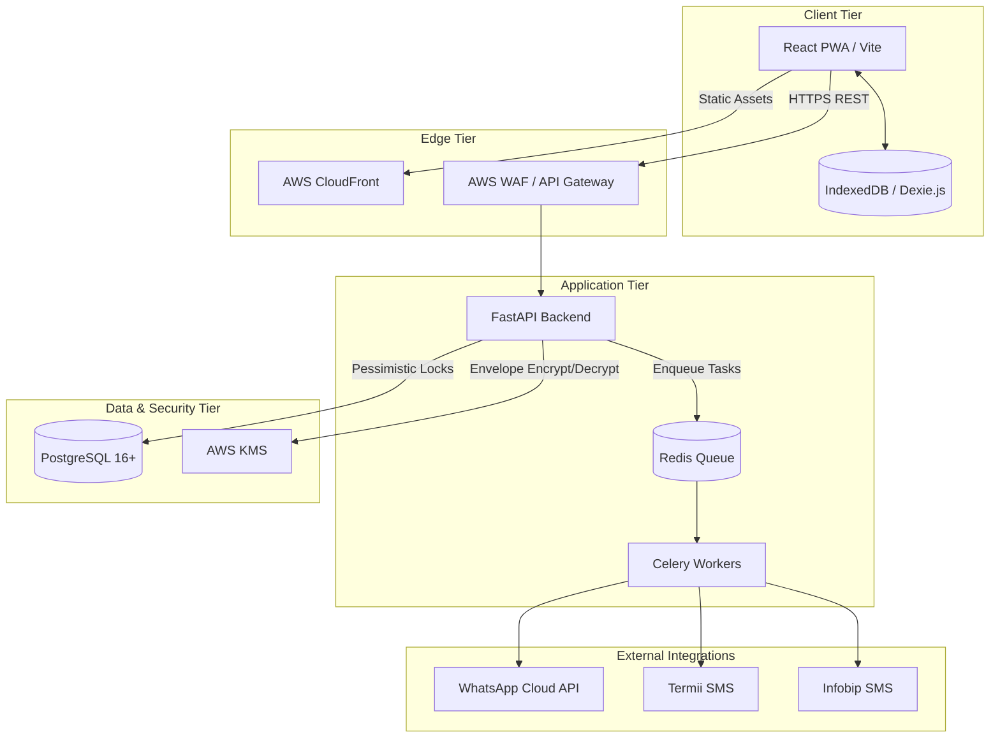
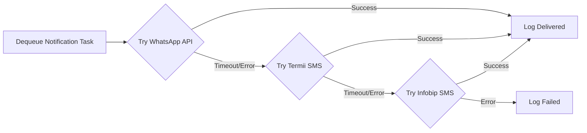

# Clinic Modernization Platform (CMP) — Implementation Plan

This document serves as the authoritative, exhaustive Implementation Plan for the Clinic Modernization Platform (CMP). It is designed to guide engineering teams and coding agents through the architectural boundaries, data models, security policies, and step-by-step execution strategy required to deliver the Phase 1 MVP within the mandated 4-month timeline.

---

## Table of Contents
1. [High-Level System Architecture & Component Boundaries](#1-high-level-system-architecture--component-boundaries)
2. [Core Data Models & Database Schemas](#2-core-data-models--database-schemas)
3. [API Contracts & Inter-Service Communication](#3-api-contracts--inter-service-communication)
4. [Security Policies, Threat Models & Authentication](#4-security-policies-threat-models--authentication)
5. [Phased Implementation Strategy (4-Month Timeline)](#5-phased-implementation-strategy-4-month-timeline)
6. [Critical Technical Decisions & Trade-offs](#6-critical-technical-decisions--trade-offs)

---

## 1. High-Level System Architecture & Component Boundaries

The CMP utilizes a decoupled, cloud-native architecture optimized for low-bandwidth environments, offline resiliency, and strict data privacy.

### 1.1 Component Boundaries

*   **Frontend (Client Tier)**: A Progressive Web App (PWA) built with **React + Vite**. It uses **Workbox** for Service Worker asset caching and **Dexie.js** (IndexedDB) to cache daily schedules for 2-hour offline read-only access. Hosted statically on **AWS S3 + CloudFront**.
*   **Backend (API Tier)**: An asynchronous **FastAPI (Python 3.12)** application. It handles routing, RBAC validation, scheduling logic, and cryptographic operations. Hosted on **AWS ECS (Fargate)** or **AWS App Runner** behind an API Gateway.
*   **Background Processing (Worker Tier)**: A **Celery** worker pool backed by a **Redis** message broker. It handles the pluggable notification failover chain (WhatsApp → Termii → Infobip) and asynchronous audit logging.
*   **Data Tier**: A managed **PostgreSQL 16+** instance (AWS RDS) acting as the primary ACID-compliant datastore.
*   **Security Tier**: **AWS KMS** provides envelope encryption keys for application-level column encryption of clinical records.

### 1.2 Architecture Diagram



---

## 2. Core Data Models & Database Schemas

The database schema is designed in PostgreSQL to support pessimistic locking for concurrency control and application-level encryption for NDPR compliance.

### 2.1 Key Entities & Relationships

1.  **`users`**: Base table for authentication and RBAC. Contains `role` enum (`patient`, `receptionist`, `doctor`, `manager`, `admin`).
2.  **`patient_profiles`**: Confidential demographic data linked 1:1 to `users`.
3.  **`doctor_availability`**: Time-bound shift blocks. Includes `start_datetime`, `end_datetime`, and `branch_id`.
4.  **`appointments`**: The core scheduling entity. Links `patient_id`, `doctor_id`, and `branch_id`. Includes `status` and `payment_state` (for Phase 2 compatibility).
5.  **`clinical_records`**: Restricted medical data. Fields like `encrypted_notes` and `encrypted_diagnosis` store AES-256-GCM ciphertext.
6.  **`security_audit_logs`**: Immutable append-only table tracking all clinical data access and scheduling overrides.
7.  **`verification_otps`**: Tracks multi-channel OTP delivery states.

### 2.2 Concurrency Control (Pessimistic Locking)

To satisfy **FR-019** (Server-Side Booking Validation), the database utilizes explicit row-level locks. Coding agents must implement this using SQLAlchemy's `with_for_update()`:

```python
# Implementation standard for booking concurrency
async with session.begin():
    # 1. Lock the doctor's availability shift
    shift = await session.execute(
        select(DoctorAvailability)
        .where(
            DoctorAvailability.doctor_id == req.doctor_id,
            DoctorAvailability.start_datetime <= req.start_datetime,
            DoctorAvailability.end_datetime >= req.end_datetime,
            DoctorAvailability.is_cancelled == False
        )
        .with_for_update() # Acquires SELECT ... FOR UPDATE lock
    )
    
    # 2. Check for overlapping appointments (locked)
    conflict = await session.execute(
        select(Appointment)
        .where(
            Appointment.doctor_id == req.doctor_id,
            Appointment.status == 'booked',
            Appointment.start_datetime < req.end_datetime,
            Appointment.end_datetime > req.start_datetime
        )
        .with_for_update()
    )
    
    if conflict.first():
        raise HTTPException(status_code=409, detail="Slot is no longer available.")
        
    # 3. Insert appointment and commit (releases locks)
```

---

## 3. API Contracts & Inter-Service Communication

Communication between the PWA and FastAPI backend is strictly RESTful over TLS 1.3. Background tasks communicate via Redis.

### 3.1 Core REST Endpoints

**1. Create Appointment**
*   **Endpoint**: `POST /api/v1/appointments`
*   **Auth**: Bearer Token (Roles: `patient`, `receptionist`, `manager`)
*   **Payload**:
    ```json
    {
      "doctor_id": "uuid",
      "branch_id": "string",
      "start_datetime": "ISO8601",
      "end_datetime": "ISO8601",
      "booking_source": "patient"
    }
    ```
*   **Response**: `201 Created` with `appointment_id`.

**2. Submit Clinical Record**
*   **Endpoint**: `POST /api/v1/clinical-records`
*   **Auth**: Bearer Token (Roles: `doctor`)
*   **Payload**:
    ```json
    {
      "appointment_id": "uuid",
      "patient_id": "uuid",
      "notes": "Plaintext notes (encrypted in backend)",
      "diagnosis": "Plaintext diagnosis (encrypted in backend)",
      "prescriptions": "Plaintext prescriptions (encrypted in backend)"
    }
    ```
*   **Response**: `201 Created` with `record_id`.

### 3.2 Pluggable Notification Failover (Worker Contract)

The system uses a Strategy Pattern for notifications. The FastAPI app pushes a generic `NotificationTask` to Redis. The Celery worker executes the failover chain:



---

## 4. Security Policies, Threat Models & Authentication

### 4.1 Threat Model & Mitigations

| Threat | Vector | Mitigation Strategy |
| :--- | :--- | :--- |
| **Data Breach (Insider Threat)** | DB Admin accesses patient records. | **Application-Level Encryption**: Clinical notes are encrypted via AES-256-GCM before DB insertion. DB Admins only see ciphertext. |
| **Race Conditions** | Concurrent booking requests. | **Pessimistic Locking**: `SELECT ... FOR UPDATE` ensures atomic slot reservation. |
| **Account Takeover** | Brute-forcing OTPs. | **Rate Limiting & Expiry**: Max 5 attempts per OTP, 10-minute expiry, max 3 requests per 15 mins per IP/Phone. |
| **Unauthorized Access** | Patient accessing doctor endpoints. | **Strict RBAC**: FastAPI `SecurityScopes` validate JWT role claims on every route. |

### 4.2 Authentication & Authorization (RBAC)

*   **Protocol**: Stateless JWT (JSON Web Tokens) with short expiration (1 hour) and HTTP-only refresh tokens (7 days).
*   **Roles**: `patient`, `receptionist`, `doctor`, `manager`, `admin`, `executive`.
*   **Implementation**: Use FastAPI's `Depends(Security(get_current_user, scopes=["doctor"]))`.

### 4.3 Cryptographic Strategy (AWS KMS Envelope Encryption)

To satisfy **NFR-006** and **NFR-008**:
1.  FastAPI requests a Data Encryption Key (DEK) from AWS KMS (`GenerateDataKey`).
2.  FastAPI encrypts the `notes`, `diagnosis`, and `prescriptions` using the plaintext DEK (AES-256-GCM).
3.  FastAPI stores the ciphertext, the Initialization Vector (IV), the Auth Tag, and the *Encrypted* DEK (or KMS Key Version ID) in PostgreSQL.
4.  The plaintext DEK is immediately wiped from application memory.

---

## 5. Phased Implementation Strategy (4-Month Timeline)

This step-by-step plan is designed for execution by engineering teams and coding agents.

### Phase 1: Foundation & Infrastructure (Weeks 1-3)
*   **Step 1.1**: Provision AWS Infrastructure (VPC, RDS PostgreSQL 16, ElastiCache Redis, KMS Keys).
*   **Step 1.2**: Initialize FastAPI project structure (routers, services, models, schemas).
*   **Step 1.3**: Implement SQLAlchemy ORM models and Alembic migrations based on the ERD.
*   **Step 1.4**: Implement JWT Authentication, RBAC middleware, and the Channel-Agnostic OTP Verification Engine.

### Phase 2: Scheduling Engine & Concurrency (Weeks 4-6)
*   **Step 2.1**: Build `DoctorAvailability` CRUD endpoints for time-bound shifts.
*   **Step 2.2**: Implement the `create_booking` service with PostgreSQL pessimistic locking (`with_for_update()`).
*   **Step 2.3**: Develop the Progressive Cancellation Penalty Engine (Tier 1 to Tier 3 logic based on rolling 90-day incident counts).
*   **Step 2.4**: Implement Administrative Overrides and Emergency Exemptions with audit logging.

### Phase 3: Clinical Records & Cryptography (Weeks 7-9)
*   **Step 3.1**: Integrate `boto3` for AWS KMS envelope encryption.
*   **Step 3.2**: Build custom SQLAlchemy types or service-layer interceptors to automatically encrypt/decrypt `clinical_records` fields.
*   **Step 3.3**: Implement the Immutable Security Audit Log trigger for all clinical reads/writes.
*   **Step 3.4**: Develop Cross-Branch Emergency Access endpoints.

### Phase 4: Frontend PWA & Offline Resiliency (Weeks 10-12)
*   **Step 4.1**: Scaffold Vite + React SPA with TailwindCSS and Radix UI.
*   **Step 4.2**: Implement Workbox for Service Worker registration and static asset caching.
*   **Step 4.3**: Integrate Dexie.js. Build a background sync hook that downloads the current day's schedule to IndexedDB upon receptionist/doctor login.
*   **Step 4.4**: Implement the "Offline Mode" UI banner and read-only fallback logic when `navigator.onLine` is false.

### Phase 5: Notification Failover & Integrations (Weeks 13-14)
*   **Step 5.1**: Define the `NotificationService` interface (Strategy Pattern).
*   **Step 5.2**: Implement concrete adapters: `WhatsAppCloudAPIClient`, `TermiiSMSClient`, `InfobipSMSClient`.
*   **Step 5.3**: Configure Celery workers to execute the 15-second timeout failover chain.
*   **Step 5.4**: Wire notification triggers to appointment state changes (Booked, Cancelled, Reminders).

### Phase 6: Testing, UAT & Deployment (Weeks 15-16)
*   **Step 6.1**: Execute Integration Tests (specifically testing DB lock contention and KMS decryption).
*   **Step 6.2**: Execute Load Testing (k6) to verify sub-2.0s search latency (NFR-001).
*   **Step 6.3**: Deploy PWA to S3/CloudFront and Backend to ECS.
*   **Step 6.4**: Pilot rollout at Branch A.

---

## 6. Critical Technical Decisions & Trade-offs

Coding agents must respect the following architectural constraints established in the ADRs:

1.  **Relational Rigidity over NoSQL Flexibility (ADR-001)**: PostgreSQL was chosen explicitly for its native row-level locking. Do not attempt to implement application-level mutexes (e.g., Redis Redlock) for scheduling; rely entirely on DB transactions.
2.  **Client-Side Rendering over SSR (ADR-002)**: The frontend must be a static SPA. Do not introduce Next.js SSR or Node.js server components. The offline requirement (NFR-004) dictates that the app shell must run entirely in the browser via Service Workers.
3.  **Searchability vs. Privacy (ADR-003)**: Because clinical notes are encrypted at the application layer, standard SQL `LIKE` searches on medical text are impossible. Do not attempt to write SQL queries filtering by diagnosis text. All searches must be performed on unencrypted metadata (e.g., `patient_id`, `created_at`).
4.  **Async Notification Offloading (ADR-004)**: Never execute external HTTP requests to WhatsApp or SMS gateways synchronously within a FastAPI route. All notifications must be pushed to the Redis queue to ensure API response times remain under the 3.0s threshold.