# Frontend Engineer Agent

## Role
You are the Frontend UI Engineer. Your job is to implement the user interface based on `implementation-plan.md` and the SSOT.

## Context
--- adr-001-postgresql-primary-datastore.md ---
# ADR-001: Choice of PostgreSQL as the Primary Datastore

**Status**: Accepted
**Date**: 2026-06-04
**Deciders**: Antigravity (AI Architect), Clinic Owner, Engineering Lead

## Context

The Clinic Modernization Platform (CMP) manages scheduling, availability shifts, and medical records across a growing chain of clinic branches. The system has critical requirements around scheduling consistency:
1. **FR-004** (Cross-Branch Schedule Conflict Check): Prevent double-booking a doctor across different branches.
2. **FR-019** (Server-Side Booking Validation & Locking): Prevent concurrent booking race conditions when multiple users select the same slot.
3. **NFR-001** (Database Search Latency): Search queries for patient records and doctor schedules must return in less than 2.0 seconds under 100 concurrent users.

Additionally, the future Phase 2 requires:
1. Support for AI scheduling chatbots which will benefit from semantic search or vectorized lookups.
2. Financial billing tables designed to prevent future schema rewrites (INT-005).

## Decision

We will use **PostgreSQL** (version 16+) as the primary relational database, deployed as a managed database instance (e.g., AWS RDS or Supabase). All database access from the backend will go through an ORM (SQLAlchemy or SQLModel) for structured model definitions, but concurrent booking checks will utilize direct raw/ORM-backed database-level pessimistic locking (`SELECT ... FOR UPDATE`).

## Options Considered

### Option 1: PostgreSQL (Relational DB with Transactional Locks) — Chosen

A robust SQL database with full ACID compliance, powerful query optimization, explicit transaction isolation levels, and native support for row-level locking.

* **Pros**:
  * Native support for `SELECT ... FOR UPDATE` locks row entries during booking evaluations, completely eliminating scheduling race conditions.
  * Fully relational structure fits the normalized scheduling schema (Doctor, Patient, Branch, Shift, Appointment) perfectly.
  * Extensible with `pgvector` for Phase 2 semantic search.
  * Supported by AWS RDS, providing automated backups, replication, and multi-AZ failovers out of the box.
* **Cons**:
  * Schema migrations must be planned and executed carefully to avoid lock contention or downtime on large tables.
  * Requires active database connection pool management.
* **Estimated effort**: Low. Relational schemas are standard, and setup on AWS RDS is fully automated.

### Option 2: MongoDB (NoSQL Document DB) — Rejected

A document-based database where schedules and appointments are stored as collections of JSON-like documents.

* **Pros**:
  * Flexible schemas allow easy changes to patient profiles and consultation log structures.
  * High horizontal write throughput.
* **Cons**:
  * Lacks native database-level transactional locks across multiple separate collections (e.g., locking a doctor's availability block in one collection while booking an appointment in another) without complex, low-performance multi-document transactions.
  * High risk of concurrent booking race conditions, forcing reliance on fragile application-level mutexes or locks.
* **Estimated effort**: Medium. Implementing safe concurrency checks would require custom locking collections or distributed lock managers (like Redis Redlock), increasing system complexity.

## Rationale

PostgreSQL was chosen because the scheduling engine's integrity is the core operational requirement of this system. Ensuring that a doctor cannot be double-booked is a hard constraint (BG-004, FR-004). PostgreSQL provides native, bulletproof transaction controls at the database tier. MongoDB would require building a complex distributed lock manager at the application tier, which is an over-engineered risk for a 4-month MVP. Furthermore, PostgreSQL's maturity, indexing power, and compatibility with `pgvector` fit the system's current and future goals perfectly.

## Consequences

* **Schema Rigidity**: We must define schemas for doctors, shifts, patients, and appointments up front. Any schema changes will require SQL migrations.
* **Lock Management**: Pessimistic locks (`SELECT ... FOR UPDATE`) must be time-bound and applied only on narrow transactional blocks to avoid deadlocks or blocking standard search queries.
* **NDPR Compliance**: PostgreSQL supports robust access controls, SSL connections, and column-level access privileges, simplifying our security and regulatory compliance path.

## References

* [Clinic Modernization Platform SRD](file:///C:/Users/DELL/Documents/Project/clinic_app/software_requirements_document.md)
* [PostgreSQL Locking Documentation](https://www.postgresql.org/docs/current/explicit-locking.html)


--- adr-002-react-pwa-client.md ---
# ADR-002: Vite + React PWA (Single Page Application) for Frontend

**Status**: Accepted
**Date**: 2026-06-04
**Deciders**: Antigravity (AI Architect), Clinic Owner, Frontend Lead

## Context

The Clinic Modernization Platform (CMP) must deliver a lightweight, responsive interface optimized for:
1. Patients accessing the portal on mobile devices over standard, sometimes unstable, Nigerian 3G/4G networks (**UG-001**, **NFR-002** - page load < 3.0 seconds).
2. Receptionists and Doctors operating on desktop and tablet computers (**UG-002**, **UG-003**).
3. Local internet outages. In Nigeria, power or ISP drops are common. **NFR-004** mandates that receptionist and doctor scheduling dashboards must cache the current day's appointment lists locally in the browser, allowing read-only access for at least 2 hours during local internet failures.

The project must be completed within 4 months with a cost-effective cloud-hosting budget.

## Decision

We will build the frontend as a client-side Single Page Application (SPA) using **React** built with **Vite**, packaged as a Progressive Web App (PWA). It will utilize **Workbox** for service worker caching and **Dexie.js** (an IndexedDB wrapper) to manage local, read-only offline data storage. The frontend will be deployed as a static build to an AWS S3 Bucket fronted by Amazon CloudFront (CDN).

## Options Considered

### Option 1: Vite + React PWA (SPA + Service Workers + IndexedDB) — Chosen

A pure client-side SPA that compiles to static HTML, CSS, and JS files. The browser registers a service worker to intercept network requests, serve cached shell assets offline, and fetch/query local schedules from IndexedDB.

* **Pros**:
  * Static build allows deployment directly to S3 and CloudFront, reducing infrastructure cost to near-zero and enabling sub-second load times via edge caching.
  * Direct control over the Service Worker lifecycles, making it simple to implement the 2-hour offline read-only scheduling cache (**NFR-004**).
  * High development speed and vast ecosystem of responsive UI library components (Tailwind, Radix, Lucide Icons).
  * Decoupled architecture means API routes can evolve independently on the backend.
* **Cons**:
  * Client-side data fetching requires showing loading states on first load.
  * SEO search engine crawlability is low (not a constraint, as scheduling and clinical records are behind authentication).
* **Estimated effort**: Low. Standard React SPA template with Vite PWA plugin.

### Option 2: Next.js (App Router with SSR) — Rejected

A full-stack React framework utilizing Server-Side Rendering (SSR) and React Server Components (RSC) to render pages on the server before sending them to the client.

* **Pros**:
  * Outstanding initial page load speed for public-facing static pages due to SSR.
  * Integrated API routing and built-in optimization tools (Image, Font, Link components).
* **Cons**:
  * SSR requires running Node.js servers (e.g., on AWS ECS or Lambda), which increases hosting complexity, cloud bills, and failure points.
  * Combining SSR with Service Workers for offline PWA functionality is highly complex, as server components cannot execute when the client is disconnected.
  * Significantly steeper learning curve and slower build times.
* **Estimated effort**: High. Requires node server setup, custom fallback hydration routing, and complex PWA configuration.

## Rationale

The primary operational constraint is local internet reliability (NFR-004). If the clinic's local fiber or cellular internet connection drops, receptionists and doctors must not lose visibility of their schedules. 

A static React SPA compiled with Vite can be completely cached inside the browser using Service Workers. When the network drops, the application shell continues to run locally, loading the cached doctor schedule list from IndexedDB. Since no server-side execution is needed to render the pages, the app remains fully functional in a read-only mode offline. 

Furthermore, static hosting via Amazon CloudFront is highly cost-effective and ensures key pages load within the 3.0-second budget over Nigerian mobile networks.

## Consequences

* **State Synchronization**: We must implement synchronization scripts. The client will fetch schedules daily and write them to IndexedDB. If the client goes offline, the UI will toggle a visual "Offline Mode - Read Only" warning banner.
* **Security**: Sensitive data in IndexedDB must be purged when a user logs out or the session token expires.
* **CORS**: We must configure cross-origin resource sharing (CORS) rules on the backend to allow API requests from the static frontend CDN domain.

## References

* [Clinic Modernization Platform SRD](file:///C:/Users/DELL/Documents/Project/clinic_app/software_requirements_document.md)
* [Vite PWA Plugin Documentation](https://vite-pwa-org.netlify.app/)
* [MDN IndexedDB API](https://developer.mozilla.org/en-US/docs/Web/API/IndexedDB_API)


--- adr-003-application-level-column-encryption.md ---
# ADR-003: Application-Level Column Encryption for Clinical Records

**Status**: Accepted
**Date**: 2026-06-04
**Deciders**: Antigravity (AI Architect), Clinic Owner, Security Officer

## Context

The Clinic Modernization Platform (CMP) processes and stores highly sensitive patient medical records. To meet strict regulatory standards and privacy guarantees:
1. **NFR-005** (NDPR Compliance): All patient data must comply with the Nigeria Data Protection Regulation.
2. **NFR-006** (Data Encryption): Patient clinical notes, histories, and diagnoses must be encrypted at rest using AES-256.
3. **NFR-008** (Separation of Clinical Data): System administrators (who manage database migrations, backups, and infrastructure) must **NOT** have access to read patient clinical records, consultation notes, or diagnostic files.

## Decision

We will implement **Application-Level Column Encryption** for all restricted medical fields (such as consultation notes, diagnoses, and prescriptions). The backend application (FastAPI) will encrypt these fields using **AES-256-GCM** before inserting them into PostgreSQL. The encryption keys will be managed and rotated via **AWS KMS (Key Management Service)**. 

Only authenticated users with clinical roles (Doctors) will have permissions that allow the application to request KMS decryption for their queries. Infrastructure and database administrators will only see encrypted ciphertext strings in the database.

## Options Considered

### Option 1: Application-Level Column Encryption (AES-256-GCM + AWS KMS) — Chosen

The application encrypts specific fields at the database boundary before saving them. Keys are managed by an external KMS with strict IAM policies.

* **Pros**:
  * Guarantees absolute compliance with **NFR-008**. Database administrators, hosting providers, or backup files contain only encrypted strings (ciphertext).
  * High security: AES-256-GCM provides both confidentiality and integrity verification (authenticated encryption), preventing data tampering.
  * Integration with AWS KMS allows auditable access logging and automated key rotation.
* **Cons**:
  * Fields that are encrypted cannot be indexed or queried using standard SQL wildcard patterns (e.g., `LIKE '%diabetes%'`).
  * Slight performance overhead due to encryption/decryption cycles on the API server.
* **Estimated effort**: Medium. Requires implementing custom SQLAlchemy/SQLModel data types that automatically handle encryption/decryption, plus KMS IAM configuration.

### Option 2: Database Transparent Data Encryption (TDE) — Rejected

Transparent Data Encryption encrypts the database files on disk (storage tier). The database engine automatically decrypts data as it is read into memory.

* **Pros**:
  * Simplest to implement; requires zero application-level changes or custom query behaviors.
  * Full text searching and SQL indexing remain fully functional.
* **Cons**:
  * Does not satisfy **NFR-008**. Because decryption is transparent to database users, any database administrator or compromised database connection can query and read patient clinical notes in plaintext.
* **Estimated effort**: Low. Turn-on checkbox on AWS RDS.

## Rationale

NDPR compliance and absolute patient privacy are critical trust foundations for the clinic chain. While Database TDE secures data against physical theft of hard drives, it fails to protect against insider threats or administrative account compromise. 

Application-level encryption ensures that the database is treated strictly as a blind storage medium for clinical records. Decryption is only possible inside the application memory space, scoped to active clinical sessions. This satisfies NFR-008 and ensures that even if the SQL database is leaked or accessed by administrators, patient health records remain entirely secure.

## Consequences

* **Search Limitations**: We cannot execute standard SQL queries scanning the text of clinical notes. Search operations must rely on metadata fields (e.g., tags, codes, or date ranges) which remain unencrypted, or we must implement a local search index on the client side (after client decryption) or use secure blind index techniques if keyword search becomes a critical clinical requirement.
* **KMS Costs and Latency**: Every encryption/decryption call introduces a network roundtrip to AWS KMS. To optimize latency, we will implement KMS envelope encryption (using a local Data Encryption Key (DEK) encrypted by a KMS Master Key and cached in application memory for short intervals).
* **Deterministic vs. Probabilistic Encryption**: We will use probabilistic encryption (AES-GCM utilizes a random Initialization Vector per write), ensuring that the same note text produces different ciphertext on every write, preventing pattern analysis.

## References

* [Clinic Modernization Platform SRD](file:///C:/Users/DELL/Documents/Project/clinic_app/software_requirements_document.md)
* [NIST Guide to Attribute-Based Encryption and Key Management](https://csrc.nist.gov/)
* [AWS KMS Envelope Encryption Concepts](https://docs.aws.amazon.com/kms/latest/developerguide/concepts.html#envelope-encryption)


--- adr-004-pluggable-notification-failover.md ---
# ADR-004: Pluggable Notification Service with Multi-Provider Failover

**Status**: Accepted
**Date**: 2026-06-04
**Deciders**: Antigravity (AI Architect), Clinic Owner, Integration Engineer

## Context

The Clinic Modernization Platform (CMP) relies heavily on notifications to achieve **BG-002** (reducing patient no-shows by 25–30%). The system must send transactional notifications (booking confirmations, reminders, cancellation alerts) across WhatsApp and SMS.

In Nigeria, mobile network carrier routing is highly unstable, and strict Do-Not-Disturb (DND) policies often block transactional SMS messages unless routed through licensed domestic gateways with DND-override capabilities. The system requirements specify:
1. **INT-001**: Integrate WhatsApp Business Cloud API.
2. **INT-002**: Utilize Termii as the primary local SMS provider to bypass DND across Nigerian carriers (MTN, Airtel, Glo, 9mobile).
3. **INT-003**: Integrate Infobip as a secondary fallback SMS provider.
4. **INT-004**: Implement a pluggable `NotificationService` layer that abstracts SMS, WhatsApp, and Email integrations to avoid vendor lock-in and handle failovers automatically.

## Decision

We will design a unified, pluggable **Notification Abstraction Layer** using the Strategy Pattern. The system will define a generic `NotificationService` interface. Concrete adapter classes will implement this interface for each vendor (e.g., `WhatsAppCloudAPIClient`, `TermiiSMSClient`, `InfobipSMSClient`). 

The application will route notification tasks to an async worker queue (e.g., Celery or FastAPI Background Tasks) executing a failover chain:
1. Attempt delivery via WhatsApp Business Cloud API.
2. If WhatsApp fails (network error, account issue, or user phone has no WhatsApp), failover to SMS via Termii.
3. If Termii SMS delivery fails (timeout or gateway error), failover to SMS via Infobip.

## Options Considered

### Option 1: Pluggable Notification Service (Strategy Pattern + Async Workers) — Chosen

The application uses an interface with concrete adapters. Delivery attempts are wrapped in an async background worker that executes the failover logic in sequence.

* **Pros**:
  * Prevents vendor lock-in (**INT-004**). We can add or swap SMS providers (e.g., Twilio or Africa's Talking) by creating a new class implementing the interface.
  * Maximum delivery reliability: Ensures patients receive critical reminders even if a primary gateway goes offline.
  * Offloading execution to background tasks prevents HTTP request latency on booking confirmation pages.
* **Cons**:
  * Slightly higher codebase complexity to manage and maintain three provider integrations.
  * Risk of duplicate messages if a gateway registers a timeout but eventually delivers the message (mitigated by strict idempotency tracking in the audit logs).
* **Estimated effort**: Low to Medium. Straightforward OOP design and async task pattern.

### Option 2: Single Notification Provider (e.g., Infobip Only) — Rejected

Using a single global provider like Infobip or Twilio for both WhatsApp and SMS communications.

* **Pros**:
  * Single codebase integration, single billing entity, and simplified dashboard.
* **Cons**:
  * Vulnerable to single point of failure (if the gateway goes down, all patient reminders stop).
  * High risk of DND blocking. Global providers often struggle to bypass Nigerian DND rules as reliably as domestic specialized gateways like Termii.
  * Does not comply with the explicit requirements (**INT-002**, **INT-004**).
* **Estimated effort**: Low.

## Rationale

Nigeria's telecom environment requires local expertise for SMS delivery. Termii specializes in DND-bypass for Nigerian mobile numbers, making it the ideal primary provider for SMS. However, relying on a single provider represents an operational risk. The Strategy Pattern decouples the backend logic from the external API shapes, allowing the system to switch providers on-the-fly. Wrapping this in an async failover queue ensures high-reliability message delivery without slowing down user interactions on the booking screen.

## Consequences

* **Async Queue Infrastructure**: We must configure a task queue (such as Redis with FastAPI BackgroundTasks, or Celery) to execute notifications out-of-band.
* **Notification Tracking Database Table**: We must maintain a `NotificationLog` table to log attempts, provider used, status (pending, sent, delivered, failed), and error codes. This is critical for billing audits and optimizing failover rules.
* **Cost Management**: WhatsApp templates have distinct business-initiated conversation charges, while SMS providers charge per unit. The failover sequence prioritizes WhatsApp (cheaper/preferred for rich media) then Termii (cheaper local SMS) and then Infobip (backup).

## References

* [Clinic Modernization Platform SRD](file:///C:/Users/DELL/Documents/Project/clinic_app/software_requirements_document.md)
* [Termii SMS API Documentation](https://developers.termii.com/)
* [WhatsApp Business Cloud API Getting Started](https://developers.facebook.com/docs/whatsapp/cloud-api)


--- uml_diagrams.md ---
# Clinic Modernization Platform (CMP) — UML Design Models

This document presents the formal UML design models for the Clinic Modernization Platform (CMP). The diagrams are structured in **Mermaid** syntax, aligned with the platform's Software Requirements Document (SRD), Technical Specification, and Architecture Decision Records (ADRs).

***

## 1. Class Diagram (Static Entity Domain Model)

This diagram represents the database schema and system entities specified in **Section 4.2 (Data Model)** of the [Technical Specification](file:///C:/Users/DELL/Documents/Project/clinic_app_ase/technical_specification.md) and **DR-004** of the [Software Requirements Document](file:///C:/Users/DELL/Documents/Project/clinic_app_ase/software_requirements_document.md).

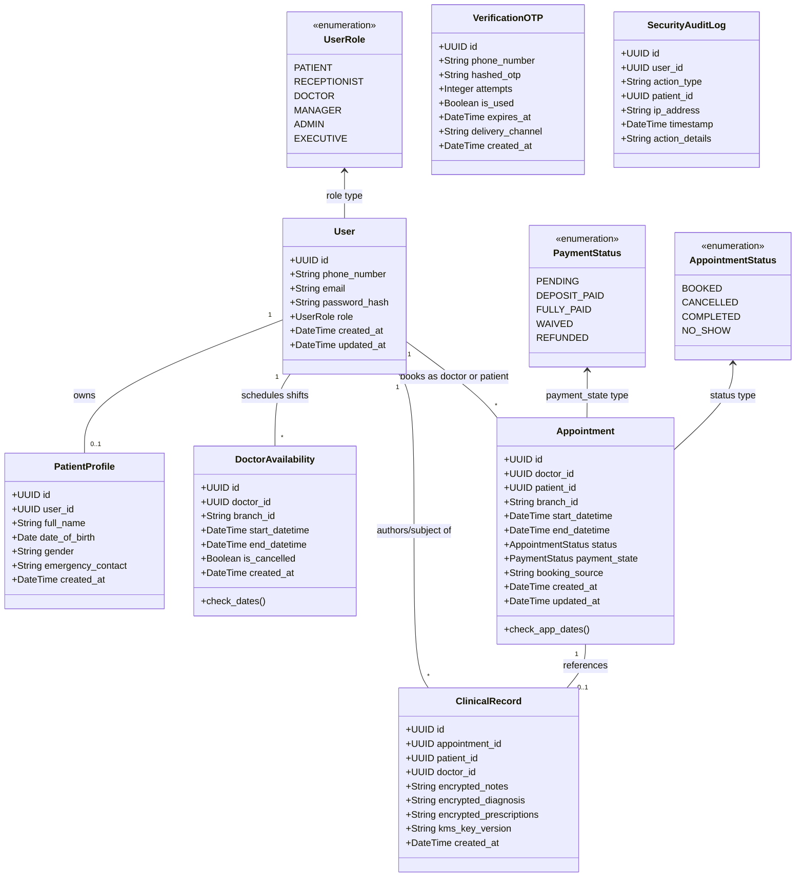

***

## 2. Component Diagram (FastAPI Backend Architecture)

Decomposes the logical architecture of the **FastAPI Container** based on **Level 3 Component Diagram** of the [C4 Architecture Models](file:///C:/Users/DELL/Documents/Project/clinic_app_ase/c4_architecture_models.md) and design choices in [ADR-003](file:///C:/Users/DELL/Documents/Project/clinic_app_ase/adr-003-application-level-column-encryption.md) and [ADR-004](file:///C:/Users/DELL/Documents/Project/clinic_app_ase/adr-004-pluggable-notification-failover.md).

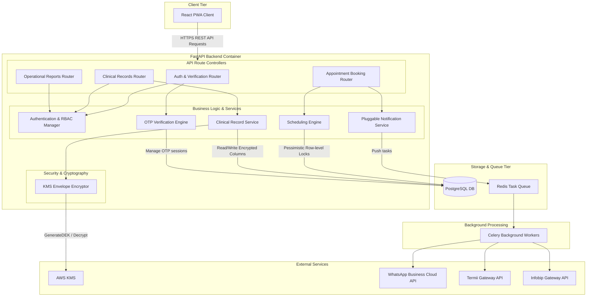

***

## 3. Behavioral Sequence Diagrams

### 3.1 Doctor Shift Validation & Concurrent Booking (Pessimistic Locking)

Illustrates how the database pessimistic locking mechanism (**FR-019**, **NFR-001**) handles two concurrent requests trying to book the exact same doctor time-slot.

```mermaid
sequenceDiagram
    autonumber
    actor PatientA as Patient A Client
    actor PatientB as Patient B Client
    participant API as FastAPI Backend
    participant DB as PostgreSQL DB

    Note over PatientA, DB: Concurrent booking requests for Dr. X at Monday 9:00 AM
    PatientA->>API: POST /api/v1/appointments (Dr. X, 9:00 AM)
    PatientB->>API: POST /api/v1/appointments (Dr. X, 9:00 AM)

    critical Transaction A starts
        API->>DB: BEGIN Transaction A
        API->>DB: SELECT DoctorAvailability with_for_update() (Dr. X, Monday 9 AM - 9:30 AM)
        activate DB
        Note over DB: Lock acquired for Transaction A on DoctorAvailability row
    and Transaction B starts
        API->>DB: BEGIN Transaction B
        API->>DB: SELECT DoctorAvailability with_for_update() (Dr. X, Monday 9 AM - 9:30 AM)
        Note over DB: Transaction B BLOCKED, waiting for Lock on DoctorAvailability row
    end

    API->>DB: SELECT Appointments with_for_update() (Dr. X, Monday 9:00 AM)
    DB-->>API: No conflicting appointments found
    API->>DB: INSERT INTO appointments (Dr. X, Patient A, booked)
    API->>DB: COMMIT Transaction A
    deactivate DB
    Note over DB: Lock released. Transaction A committed.

    activate DB
    Note over DB: Transaction B unblocks, lock acquired by Transaction B
    DB-->>API: Returns DoctorAvailability shift data
    API->>DB: SELECT Appointments with_for_update() (Dr. X, Monday 9:00 AM)
    DB-->>API: Conflict found (Appointment for Patient A exists)
    API->>DB: ROLLBACK Transaction B
    deactivate DB
    Note over DB: Lock released. Transaction B rolled back.
    API-->>PatientA: HTTP 201 Created (Appointment ID)
    API-->>PatientB: HTTP 409 Conflict ("Slot is no longer available")
```

### 3.2 Hierarchical Verification & OTP Delivery Flow (WhatsApp-First, SMS Fallback)

Visualizes the multi-gateway verification flow (**OQ-002**, **INT-004**) attempting delivery via WhatsApp, falling back to local Termii SMS, and backing up to Infobip.

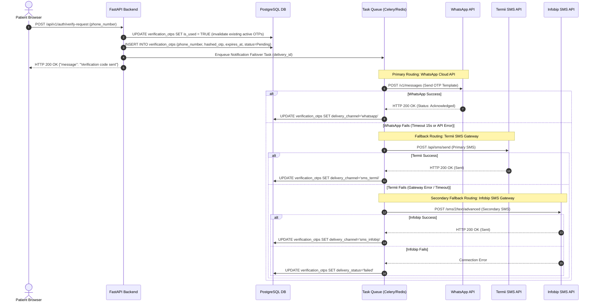

### 3.3 Clinical Consultation Logging & Audited Record Access

Represents the cryptographic workflow (**FR-006**, **FR-007**, **NFR-006**, **NFR-007**, **NFR-008**) for writing encrypted records and logging emergency overrides.

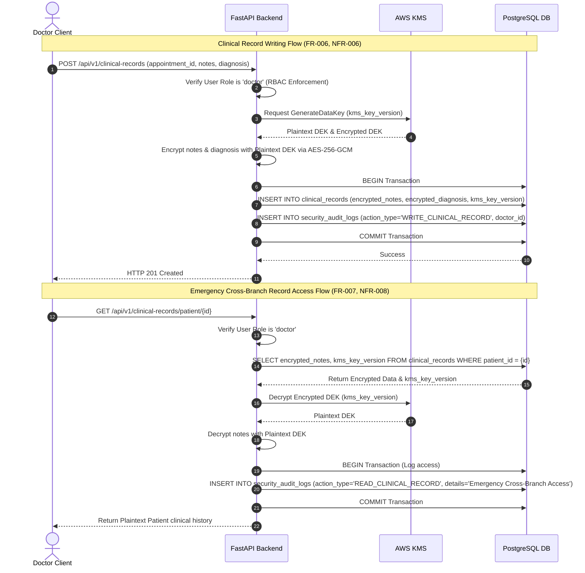

***

## 4. Entity Lifecycle State Diagrams

### 4.1 Appointment & Payment State Machine

Maps out status and payment transitions for the main scheduling unit (**DR-004**, **INT-005**).

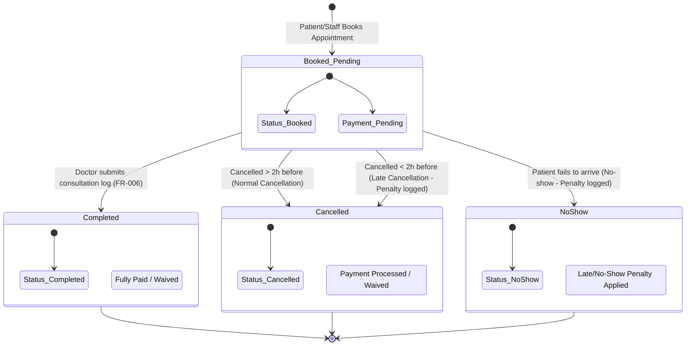

### 4.2 Patient Penalty & Booking Restriction Lifecycle

Shows how late cancellations and no-shows affect patient booking permissions in rolling 90-day windows (**FR-012**, **FR-013**, **FR-014**).

```mermaid
stateDiagram-v2
    [*] --> Normal : New Patient Account Registered
    
    Normal --> Tier1_Warning : 1st Late Cancel / No-show
    Tier1_Warning --> Tier2_SoftFlag : 2nd-3rd Late Cancel / No-show
    Tier2_SoftFlag --> Tier3_Restricted : >= 4th Late Cancel / No-show

    Tier3_Restricted --> Tier2_SoftFlag : rolling 90 days elapse for older incidents
    Tier2_SoftFlag --> Tier1_Warning : rolling 90 days elapse for older incidents
    Tier1_Warning --> Normal : rolling 90 days elapse for older incidents

    state Normal {
        Note: Full self-service online booking enabled
    }
    state Tier1_Warning {
        Note: Warning banner shown on booking/cancellation screen
    }
    state Tier2_SoftFlag {
        Note: Soft flag on profile; requires confirmation to schedule
    }
    state Tier3_Restricted {
        Note: Online booking BLOCKED. Requires receptionist manual override.
    }
```

***

## 5. Activity Control Flow Diagrams

### 5.1 Booking Request & Restriction Validation Flow

Details the step-by-step control logic executed by the scheduling engine when a booking request arrives (**FR-003**, **FR-015**, **FR-019**).

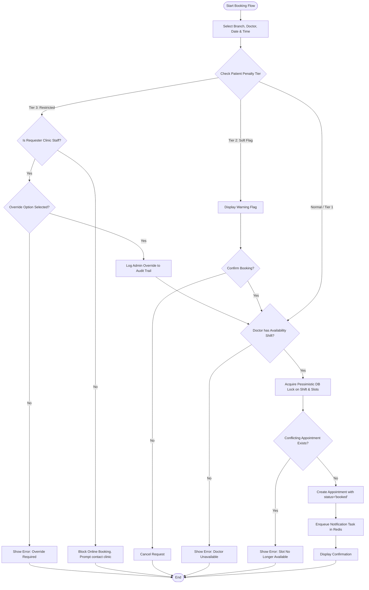

### 5.2 Cancellation Penalty Engine Control Flow

Details the business rules processed by the system when an appointment is cancelled (**FR-012** to **FR-017**).

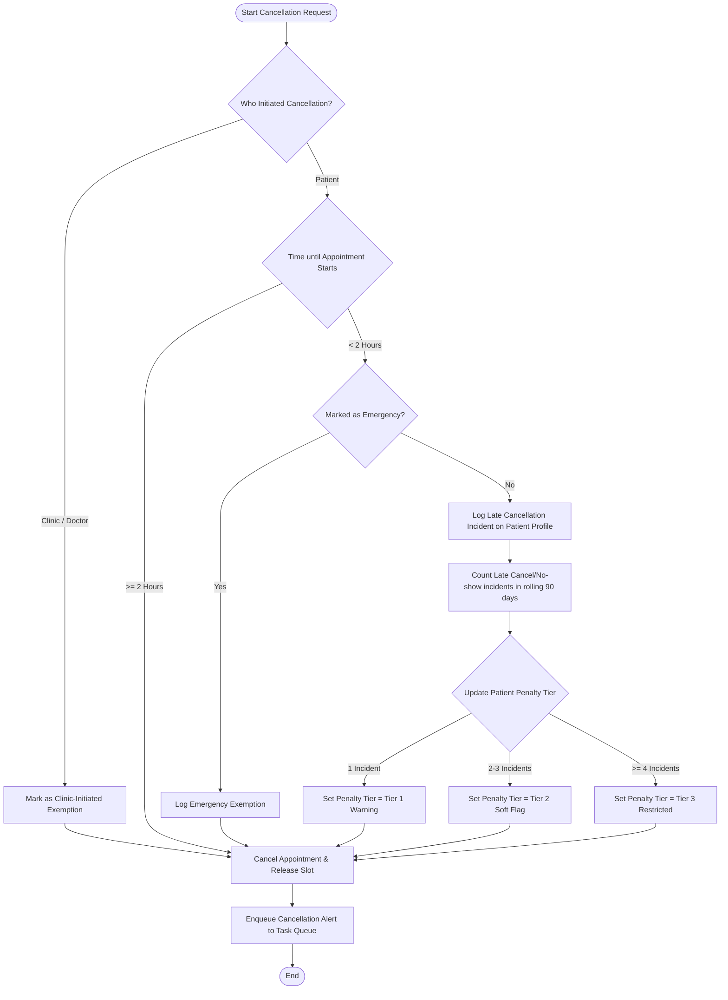


--- software_requirements_document.md ---
# Clinic Modernization Platform (CMP) — Software Requirements Document

**Author**: Antigravity (AI Architect)
**Reviewers**: Clinic Owner, Senior Stakeholders
**Status**: Approved
**Version**: 1.3
**Date**: 2026-06-04
**Project Type**: Hybrid

---

## 1. Executive Summary

The Clinic Modernization Platform (CMP) is a scalable, cloud-hosted clinic management system designed to transition a chain of three private healthcare clinics (scaling to 10–15 branches) from manual paper-and-chat workflows to digital operations. The platform provides patients with self-service mobile booking, Receptionists with desktop check-in and scheduling tools, and Doctors with tablet-optimized clinical records. The system utilizes automated WhatsApp and SMS reminders to dramatically reduce patient no-show rates, while ensuring strict data privacy in compliance with Nigeria's Data Protection Regulation (NDPR). It is architected to allow the seamless introduction of an AI scheduling chatbot and online payments in subsequent phases.

---

## 2. Project Goals

### 2.1 Business Goals
- **BG-001**: Reduce receptionist time spent on manual appointment scheduling by 70% within 6 months of deployment.
- **BG-002**: Reduce patient appointment no-show rates by 25–30% within 6 months using automated notifications.
- **BG-003**: Digitise 100% of new patient registration and clinical consultation records at all active branches.
- **BG-004**: Eliminate schedule conflicts and double-bookings for permanent and rotating doctors across all branches.
- **BG-005**: Provide real-time, consolidated operational performance dashboards to management, eliminating manual report compilation.

### 2.2 User Goals
- **UG-001 (Patients)**: Book, view, reschedule, or cancel clinic appointments via a responsive mobile portal and receive timely text reminders.
- **UG-002 (Receptionists)**: Register new patients, manage appointment check-ins, view doctor timetables, and handle phone/walk-in bookings quickly.
- **UG-003 (Doctors)**: Access patient clinical history, record consultation notes, input diagnoses/treatments, and view daily schedules from a tablet or desktop.
- **UG-004 (Branch Managers)**: Monitor patient attendance, doctor utilization, and operational reports for their assigned clinic location.
- **UG-005 (Senior Management)**: Review consolidated aggregated metrics across all clinic branches in real-time.

### 2.3 Non-Goals
- **NG-001**: The system SHALL NOT provide clinical medical diagnoses or treatment suggestions via AI.
- **NG-002**: Digitisation or back-entry of historical paper patient files created prior to system deployment is out of scope for the initial release.
- **NG-003**: Native Android or iOS mobile applications are out of scope (responsive web client is mandatory).
- **NG-004**: Integrated real-time video/audio telemedicine consultations are excluded from Phase 1.
- **NG-005**: Financial billing and online payment processing gates are excluded from Phase 1 (supported in DB design only).

---

## 3. Stakeholders & Users

| Role | Description | Interaction Type |
|---|---|---|
| **Patient** | Registers, books appointments, views active prescriptions and released test results on mobile. | Direct / Mobile Responsive Portal |
| **Receptionist** | Handles front-desk check-in, edits patient profile data, records offline/phone bookings. | Direct / Desktop UI |
| **Doctor** | Views personal timetable, inputs consultation logs, views unified clinical histories. | Direct / Tablet & Desktop UI |
| **Branch Manager** | Monitors single-branch operational dashboard and staff attendance metrics. | Direct / Laptop Web UI |
| **Senior Manager** | Evaluates aggregated cross-clinic dashboards, utilization rates, and trends. | Direct / Laptop Web UI |
| **System Administrator**| Configures clinic settings, manages branches, adjusts user roles and permissions. | Direct / Admin Console |
| **WhatsApp Gateway** | Outbound messaging channel for reminders and status updates. | REST API / Webhook |
| **SMS Gateway** | Failover outbound messaging channel for critical communications. | REST API |

---

## 4. Assumptions & Constraints

### 4.1 Assumptions

| # | Assumption | Impact if Wrong |
|---|---|---|
| **A-001** | Patients have active mobile data/network access to load a lightweight mobile portal. | Patient self-service booking drops; reception workload remains high. |
| **A-002** | WhatsApp Business Cloud API provides reliable delivery of templated notifications in Nigeria. | Failures trigger SMS fallback, increasing platform SMS operating costs. |
| **A-003** | Local power outages in branches are mitigated by local clinic generators/UPS systems. | Branch workstations lose access to system; local cache access is required. |
| **A-004** | Medical staff are willing to enter digital notes instead of writing on paper. | Data completeness drops; business metrics cannot be generated. |

### 4.2 Constraints

| Type | Constraint |
|---|---|
| **Timeline** | MVP (Phase 1) MUST be fully deployed and operational within 4 months from project kick-off. |
| **Budget** | Initial deployment costs must utilize cost-effective cloud services to align with business budget. |
| **Platform** | Hosted in public cloud (AWS preferred). Responsive web platform only (no native app stores). |
| **Regulatory** | MUST comply with Nigerian Data Protection Act (NDPR). Sensitive health data must be encrypted. |
| **Technology** | On-premise server installations are prohibited. System must operate purely on cloud instances. |

---

## 5. Functional Requirements

### 5.1 Patient Account & Authentication
- **FR-001 (Must)**: Patient Registration. The system SHALL allow patients to register an account.
  * *Acceptance Criteria*: Given a new patient visits the registration page, When they submit their full name, active Nigerian phone number, email, and password, Then the system creates their profile, sends a verification code, and requests login.
- **FR-002 (Must)**: Role-Based Access Control (RBAC). The system SHALL enforce strict role assignments (Patient, Receptionist, Doctor, Manager, Administrator, Executive).
  * *Acceptance Criteria*: Given a logged-in user with "Patient" role, When they attempt to access the Doctor clinical notes URL, Then the system denies access and logs a security exception.

### 5.2 Patient Scheduling & Appointment Engine
- **FR-003 (Must)**: Appointment Booking. The system SHALL allow patients and receptionists to book appointments.
  * *Acceptance Criteria*: Given a patient selecting a branch, doctor, and date, When they choose an available time slot and submit, Then the system reserves the slot, marks it as "Booked / Unpaid", and sends a confirmation trigger.
- **FR-004 (Must)**: Cross-Branch Schedule Conflict Check. The system SHALL prevent double-booking a doctor across different branches by verifying scheduling availability globally before slot confirmation.
  * *Acceptance Criteria*: Given Dr. X is scheduled to work at Branch A on Monday 9 AM - 1 PM, When a receptionist attempts to book Dr. X at Branch B for Monday 10 AM, Then the system blocks the booking and displays a scheduling error.
- **FR-005 (Must)**: Rescheduling & Cancellation. The system SHALL allow patients to reschedule or cancel appointments up to 2 hours before the scheduled time.
  * *Acceptance Criteria*: Given a patient with an appointment in 3 hours, When they click "Cancel" on the portal, Then the system updates the appointment state to "Cancelled", releases the time slot, and schedules a cancellation notification.
- **FR-012 (Must)**: Progressive Cancellation Warning (Tier 1). The system SHALL trigger a warning and log a penalty incident if a patient cancels an appointment less than 2 hours before the scheduled start time.
  * *Acceptance Criteria*: Given a patient with an appointment in 1.5 hours, When they click "Cancel" on the portal, Then the system displays a late-cancellation warning message, logs the incident against their profile, and updates the appointment state to "Cancelled" without blocking the action.
- **FR-013 (Must)**: Booking Soft Flagging (Tier 2). The system SHALL apply a "Soft Flag" on patients who accumulate 2 to 3 late cancellations or no-shows within a rolling 90-day window.
  * *Acceptance Criteria*: Given a patient with 2 previous late cancellations, When they or a receptionist attempt to create a new booking, Then the system displays a visual warning flag on their profile status, requiring confirmation before finalizing.
- **FR-014 (Must)**: Booking Restrictions (Tier 3). The system SHALL restrict self-service booking privileges for patients who accumulate 4 or more late cancellations or no-shows within a rolling 90-day window.
  * *Acceptance Criteria*: Given a patient with 4 previous late cancellations, When they attempt to book an appointment online, Then the system blocks the self-service booking flow, displays a message instructing them to contact the clinic directly, and requires receptionist/manager manual approval.
- **FR-015 (Must)**: Administrative Override for Booking Restrictions. The system SHALL allow authorized staff (Receptionists, Doctors, Managers) to manually override any patient booking restriction or soft flag during walk-in or phone registration.
  * *Acceptance Criteria*: Given a receptionist booking for a patient with Tier 3 restrictions, When they select "Override Restriction", Then the system permits the booking and logs the override with the receptionist's ID.
- **FR-016 (Must)**: Emergency Exemption. The system SHALL allow patients or staff to flag a late cancellation as an "Emergency", exempting the patient from penalty counting.
  * *Acceptance Criteria*: Given a patient cancelling an appointment in 1 hour, When they select "Emergency Cancellation", Then the system logs the cancellation for analytical tracking, but does not increment their late cancellation penalty count.
- **FR-017 (Must)**: Clinic-Initiated Cancellation Exemption. The system SHALL NOT penalize patients for cancellations initiated by the clinic or doctor.
  * *Acceptance Criteria*: Given a clinic-initiated schedule adjustment, When the administrator cancels the patient's appointment, Then the system does not apply a late cancellation count and marks the patient record for priority rescheduling.
- **FR-018 (Must)**: Time-Bound Availability Shifts. The system SHALL support scheduling doctors in branch-specific time-bound availability blocks rather than assigning a doctor statically to a single branch.
  * *Acceptance Criteria*: Given a doctor who works at Branch A on Monday mornings and Branch B on Monday afternoons, When availability is configured, Then the system saves separate time-bound shift blocks mapping the doctor to Branch A (09:00 - 13:00) and Branch B (14:00 - 18:00) respectively.
- **FR-019 (Must)**: Server-Side Booking Validation & Locking. The system scheduling engine SHALL validate bookings against the doctor's availability blocks and active appointments using database-level transactional locks to prevent race conditions during concurrent bookings.
  * *Acceptance Criteria*: Given two users attempting to book the exact same slot concurrently, When both requests hit the server, Then the database executes a transactional block locking the doctor schedule, registers the first request, and rejects the second request with a "Slot no longer available" error.
- **FR-020 (Must)**: Emergency Schedule Override. The system SHALL allow senior authorized users (Administrators, Managers) to manually override standard availability blocks to book emergency appointments, creating a linked audit log.
  * *Acceptance Criteria*: Given a manager booking an urgent walk-in appointment outside a doctor's scheduled shift, When they click "Schedule Override", Then the system creates the appointment and generates a detailed audit record containing the manager's ID, override reason, and timestamp.
- **FR-021 (Must)**: Doctor Shift Change Revalidation. The system SHALL automatically scan active appointments and flag conflicts when a doctor availability block is cancelled or reassigned.
  * *Acceptance Criteria*: Given a doctor shift is cancelled, When the scheduler updates the shift status, Then the system flags all affected appointments, alerts the branch manager, and triggers automated rescheduling notifications to the patients.

### 5.3 Clinical Records & Doctor Workspace
- **FR-006 (Must)**: Clinical Consultation Logging. The system SHALL allow doctors to record patient visit notes, diagnoses, and prescriptions.
  * *Acceptance Criteria*: Given a doctor in a session with a checked-in patient, When they submit the consultation form, Then the system updates the patient history record, encrypts the note, and marks the visit as "Completed".
- **FR-007 (Must)**: Emergency Cross-Branch Record Access. The system SHALL allow a licensed doctor to access a patient's historical records regardless of the registration branch.
  * *Acceptance Criteria*: Given a patient registered at Branch A visiting Branch B, When the attending doctor at Branch B requests access to the patient's record, Then the system displays the medical history and creates an audit log entry tagged with "Emergency Cross-Branch Access" containing the doctor's credentials and timestamp.
- **FR-008 (Must)**: Controlled Release of Lab Results. The system SHALL hide newly uploaded laboratory or diagnostic files from the patient until marked "Released" by a doctor.
  * *Acceptance Criteria*: Given a newly uploaded laboratory PDF, When the patient checks their portal before doctor review, Then the PDF is hidden. When the doctor marks the file status as "Released to Patient", Then the PDF becomes immediately visible on the patient's portal dashboard.

### 5.4 Check-in & Front Desk Operations
- **FR-009 (Must)**: Walk-In Registration. The system SHALL allow receptionists to register patients and book appointments.
  * *Acceptance Criteria*: Given a receptionist at the front desk, When they enter a walk-in patient's basic details and select an immediate vacant doctor slot, Then the system creates the profile and marks the appointment as "Booked - In Clinic".
- **FR-010 (Must)**: Patient Check-In. The system SHALL allow receptionists to mark patient arrival.
  * *Acceptance Criteria*: Given an upcoming appointment for the day, When the receptionist clicks "Check In" upon patient arrival, Then the system changes the appointment status to "Checked In" and notifies the assigned doctor's dashboard.

### 5.5 Management dashboards
- **FR-011 (Must)**: Real-time Operational Reports. The system SHALL display operational reports to authorized Managers and Senior Management.
  * *Acceptance Criteria*: Given a logged-in Branch Manager, When they load the dashboard, Then the system displays real-time statistics for daily appointments, doctor utilization, and no-shows for their assigned branch only.

---

## 6. Non-Functional Requirements

### 6.1 Performance
- **NFR-001**: **Database Search Latency**. Search queries for patient records or doctor schedules SHALL return results in less than 2.0 seconds under a baseline load of 100 concurrent users.
- **NFR-002**: **Page Load Speed**. Key web portal landing pages SHALL load in less than 3.0 seconds when accessed over a standard 3G/4G network connection in Nigeria.

### 6.2 Availability & Reliability
- **NFR-003**: **Core Service Availability**. The system SHALL maintain ≥ 99.9% uptime monthly during standard clinic operating hours (Monday to Saturday, 7:00 AM to 8:00 PM WAT).
- **NFR-004**: **Offline Resiliency (Caching)**. The receptionist and doctor scheduling dashboards SHALL cache the current day's appointment lists locally on the browser client, allowing read-only access for at least 2 hours in the event of local internet failure.

### 6.3 Security & Compliance
- **NFR-005**: **Data Protection Compliance (NDPR)**. The system SHALL store and process all patient data in compliance with the Nigeria Data Protection Regulation (NDPR).
- **NFR-006**: **Data Encryption**. Patient clinical notes, medical histories, and diagnoses SHALL be encrypted at rest using AES-256 and in transit using TLS 1.3.
- **NFR-007**: **Immutable Security Audit Log**. The system SHALL write a permanent, immutable audit entry for every read, write, modification, or clinical override of patient medical records, recording the user ID, timestamp, patient ID, IP address, and details of the action.
- **NFR-008**: **Separation of Clinical Data**. System administrators SHALL NOT have access to read patient clinical records, consultation notes, or diagnostic images.

---

## 7. AI / Intelligent System Requirements

*Note: Phase 1 establishes the API endpoints and scheduling logic to support the Phase 2 AI WhatsApp chatbot. The chatbot itself is a Phase 2 requirement.*

| ID | Requirement | Priority | Detail / Acceptance Criteria |
|---|---|---|---|
| **AI-001** | AI Safety Refusal | High (Phase 2) | The AI scheduling chatbot SHALL refuse to answer questions about medical diagnoses, clinical symptoms, or drug recommendations, and SHALL reply with a standard disclaimer directing the user to book a doctor consultation. |
| **AI-002** | Fallback to Rule-Based Menu | High (Phase 2) | If the AI NLP/LLM endpoint experiences a timeout (> 5.0 seconds) or is offline, the WhatsApp interface SHALL fall back to a structured, button-based interactive menu to allow basic booking functions. |
| **AI-003** | Transparency Notification | High (Phase 2) | The AI chatbot SHALL inform the patient in its first interaction that they are communicating with an automated system and not a human receptionist. |
| **AI-004** | Hand-off to Human | High (Phase 2) | If a patient asks to speak to a receptionist, or if the chatbot fails to resolve a request after three turns, the system SHALL route the conversation to the clinic's front-desk queue. |

---

## 8. Integration Requirements

| ID | External System | Integration Type | Direction | Requirement |
|---|---|---|---|---|
| **INT-001** | WhatsApp Business Cloud API | REST API | Outbound | The system SHALL send automated transactional templates (booking confirmations, change alerts, 24-hour and 2-hour reminders) to the patient's registered phone number. |
| **INT-002** | Termii Gateway | REST API | Outbound | The system SHALL utilize Termii as the primary local SMS provider to ensure delivery reliability, DND routing, and carrier compatibility (MTN/Airtel/Glo/9mobile) within Nigeria. |
| **INT-003** | Infobip Gateway | REST API | Outbound | The system SHALL integrate Infobip as the secondary backup SMS provider. |
| **INT-004** | Notification Abstraction Layer | Internal API | N/A | The system SHALL implement a pluggable `NotificationService` layer that abstracts SMS, WhatsApp, and Email integrations to avoid vendor lock-in and handle failovers automatically. |
| **INT-005** | Future Payment Gateway (Paystack/Flutterwave) | Webhooks / REST API | Bi-directional | The appointment engine database schemas SHALL implement payment states (`Pending`, `Deposit Paid`, `Fully Paid`, `Waived`, `Refunded`) to prevent schema rewrites in Phase 2. |

---

## 9. Data Requirements

- **DR-001 (Data Ownership)**: All medical records, clinical notes, and patient identifiers created on the platform remain the exclusive legal property of the healthcare clinic chain.
- **DR-002 (Data Retention)**: Medical records and patient files SHALL be retained on the active database for a minimum of 10 years, in accordance with national health archiving guidelines.
- **DR-003 (Data Classification)**:
  * **Confidential**: Patient profile details, phone numbers, email addresses.
  * **Restricted (Medical)**: Consultation logs, diagnostic images, prescriptions, diagnoses.
  * **Internal**: Operational performance reports, branch utilization metrics.
- **DR-004 (Scheduling Schema Entities)**:
  * **DoctorAvailability**: Represenation of doctor shifts containing `id` (UUID), `doctor_id` (UUID), `branch_id` (UUID), `start_datetime` (Timestamp), `end_datetime` (Timestamp), `status` (active/cancelled).
  * **Appointments**: Representation of individual booking states containing `id` (UUID), `doctor_id` (UUID), `patient_id` (UUID), `branch_id` (UUID), `start_datetime` (Timestamp), `end_datetime` (Timestamp), `status` (booked/cancelled/completed/no-show), `booking_source` (patient/receptionist/admin override).

---

## 10. Open Questions

| # | Question | Owner | Deadline | Impact |
|---|---|---|---|---|
| **OQ-001** | None | N/A | N/A | All initial elicitation open questions resolved. |

---

## 11. Glossary

| Term | Definition |
|---|---|
| **NDPR** | Nigeria Data Protection Regulation, governing data privacy and protection of Nigerian citizens. |
| **RBAC** | Role-Based Access Control, restricting system access to authorized users based on role definitions. |
| **WAT** | West Africa Time (UTC+1), the timezone for local clinic branch schedules. |
| **MVP** | Minimum Viable Product, the initial release containing only core mandatory features (Phase 1). |

---

## 12. Document Revision History

| Version | Date | Author | Changes |
|---|---|---|---|
| 1.0 | 2026-06-04 | Antigravity | Initial draft generated after Round 2 Elicitation. |
| 1.1 | 2026-06-04 | Antigravity | Updated with pluggable notifications, Termii integration, and progressive late cancellation penalty system. |
| 1.2 | 2026-06-04 | Antigravity | Integrated detailed scheduling engine rules, time-bound availability blocks, and transactional locking mechanics. |
| 1.3 | 2026-06-04 | Antigravity | Approved version. Status set to Approved. |


--- c4_architecture_models.md ---
# Clinic Modernization Platform (CMP) — C4 Architecture Models

This document presents the architecture of the Clinic Modernization Platform (CMP) using the **C4 Model** (System Context, Container, Component, and Database Entity-Relationship views) to detail the system boundaries and data flows.

---

## Level 1: System Context Diagram

The System Context diagram shows how the Clinic Modernization Platform (CMP) interacts with users (patients, clinic staff, managers) and external services (messaging gateways, encryption services).

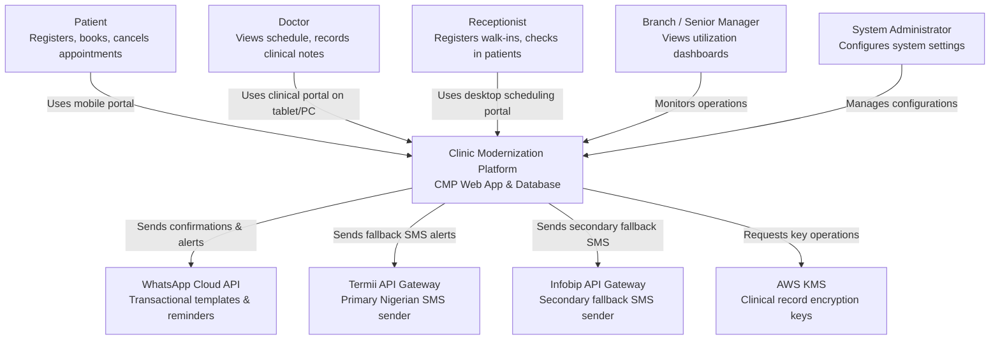

---

## Level 2: Container Diagram

The Container diagram decomposes the CMP into its runtime containers: the static **React PWA** frontend, the **FastAPI** backend API, the **PostgreSQL** database, and the **Redis/Celery** async queue.

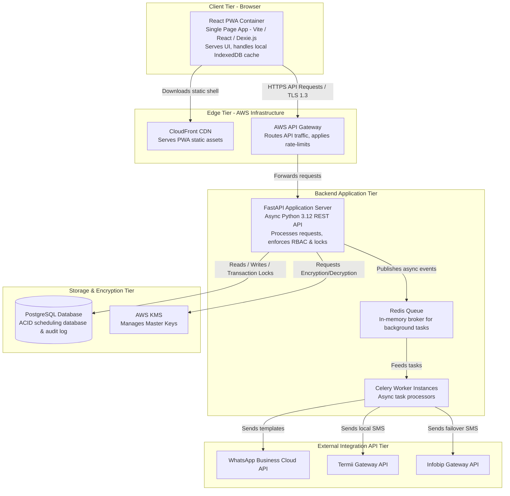

---

## Level 3: Component Diagram (FastAPI Backend)

This diagram details the internal modules of the **FastAPI Container** and how they interact to serve requests and execute business logic.

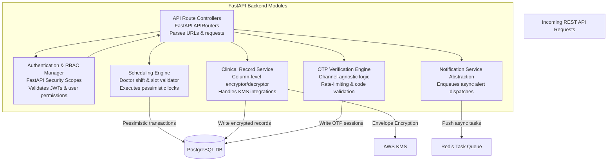

---

## Level 4: Code Diagram (Database Entity-Relationship)

The Database ERD maps the relational structure of the data layer, including constraints and primary/foreign key connections.

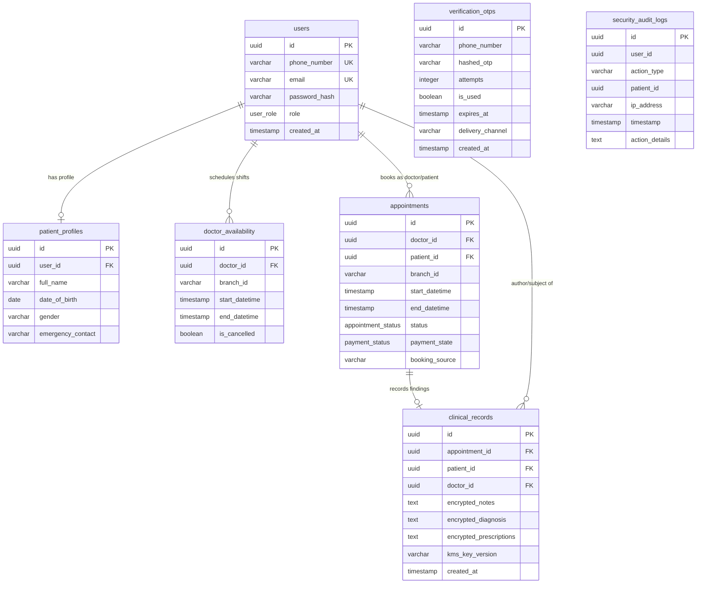


--- technical_specification.md ---
# Clinic Modernization Platform (CMP) — Technical Specification

**Author**: Antigravity (Senior AI Architect)  
**Reviewers**: Clinic Owner, Tech Lead, Security Officer  
**Status**: Draft  
**Date**: 2026-06-04  
**Target release**: Phase 1 MVP (4-Month Timeline)

---

## 1. Summary

The Clinic Modernization Platform (CMP) is a secure, cloud-hosted clinic management system designed to transition a chain of three private healthcare clinics (scaling to 10–15 branches) from manual paper-and-chat workflows to digital operations. The MVP leverages a decoupled frontend/backend structure consisting of a lightweight **Vite + React PWA** frontend, an asynchronous **FastAPI** backend, and a **PostgreSQL** database. 

It guarantees strict data privacy compliance under Nigeria's Data Protection Regulation (NDPR) via application-level column encryption, enforces atomic time-slot scheduling through database pessimistic locks, and ensures high notification delivery rates via a pluggable, multi-gateway failover engine.

---

## 2. Goals and Non-Goals

### 2.1 Goals
* **G-001**: Implement concurrent booking protection (pessimistic locking) to eliminate double-booking permanent and rotating doctors.
* **G-002**: Achieve sub-3.0 second page loads over Nigerian 3G/4G networks through a static Progressive Web App (PWA) shell.
* **G-003**: Provide offline resiliency, caching daily schedules locally on browsers for at least 2 hours of read-only access.
* **G-004**: Encrypt patient medical histories at the application layer to hide clinical records from database and cloud administrators.
* **G-005**: Automate patient check-ins and notification delivery with an abstracted failover chain (WhatsApp -> Termii SMS -> Infobip SMS).

### 2.2 Non-Goals
* **NG-001**: Implementation of real-time video/audio telemedicine consultations.
* **NG-002**: Direct integration of Paystack/Flutterwave billing processors (database models will support payment states, but transaction routing is deferred to Phase 2).
* **NG-003**: Native Android or iOS mobile applications (responsive web app only).
* **NG-004**: Automated clinical diagnosis or treatment recommendations.

---

## 3. Background

The current clinic chain relies on manual paper files and WhatsApp group chats to manage schedules and share patient data. This results in frequent scheduling conflicts, high patient no-show rates (~25–30%), and lack of auditable data access controls. 

Operating in West Africa Time (WAT), the system must account for local constraints:
1. **Network Instability**: Internet connections drop frequently, requiring offline data caching for in-clinic workstations.
2. **DND Restrictions**: Transactional SMS messages are frequently blocked by Nigerian carriers (MTN, Airtel, Glo, 9mobile) unless routed via a domestic gateway with DND-override configurations.
3. **Data Security (NDPR)**: Health records are highly regulated. Database exposure must be mitigated by cryptography.

---

## 4. Design

### 4.1 Architecture Overview

The system is designed as a decoupled Single Page Application (SPA) client communicating with an asynchronous REST API backend.

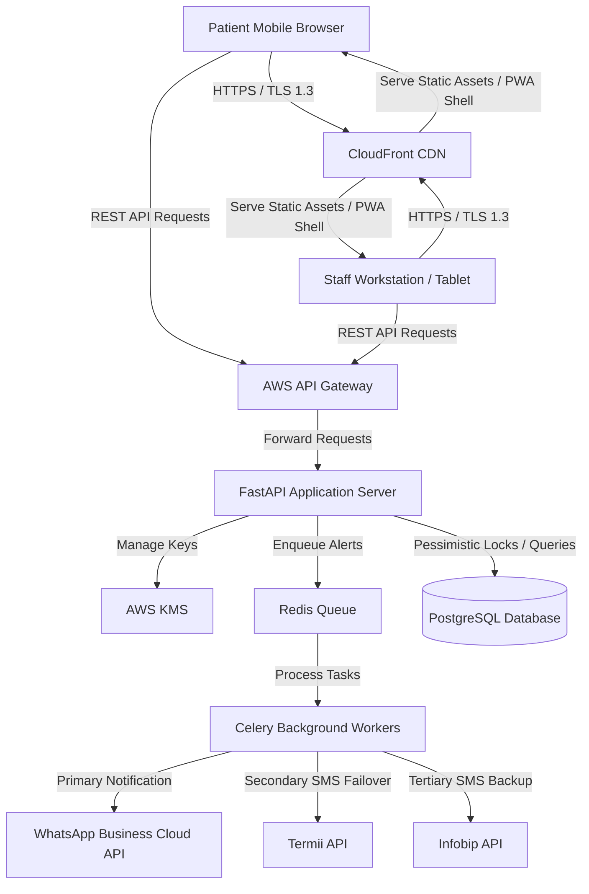

### 4.2 Data Model

To prevent future schema rewrites, the database schema integrates audit controls, availability shift models, and placeholder columns for Phase 2 payment integration.

```sql
-- Enums
CREATE TYPE user_role AS ENUM ('patient', 'receptionist', 'doctor', 'manager', 'admin', 'executive');
CREATE TYPE appointment_status AS ENUM ('booked', 'cancelled', 'completed', 'no-show');
CREATE TYPE payment_status AS ENUM ('pending', 'deposit_paid', 'fully_paid', 'waived', 'refunded');

-- Users Table (Unencrypted for authentication and routing)
CREATE TABLE users (
    id UUID PRIMARY KEY DEFAULT gen_random_uuid(),
    phone_number VARCHAR(15) UNIQUE NOT NULL,
    email VARCHAR(255) UNIQUE NOT NULL,
    password_hash VARCHAR(255) NOT NULL,
    role user_role NOT NULL,
    created_at TIMESTAMP WITH TIME ZONE DEFAULT CURRENT_TIMESTAMP,
    updated_at TIMESTAMP WITH TIME ZONE DEFAULT CURRENT_TIMESTAMP
);

-- Profiles Table (Confidential Data - NDPR Protected)
CREATE TABLE patient_profiles (
    id UUID PRIMARY KEY DEFAULT gen_random_uuid(),
    user_id UUID REFERENCES users(id) ON DELETE CASCADE,
    full_name VARCHAR(255) NOT NULL,
    date_of_birth DATE NOT NULL,
    gender VARCHAR(10),
    emergency_contact VARCHAR(255),
    created_at TIMESTAMP WITH TIME ZONE DEFAULT CURRENT_TIMESTAMP
);

-- Doctor Shifts (FR-018: Time-bound availability blocks)
CREATE TABLE doctor_availability (
    id UUID PRIMARY KEY DEFAULT gen_random_uuid(),
    doctor_id UUID REFERENCES users(id) ON DELETE CASCADE,
    branch_id VARCHAR(50) NOT NULL,
    start_datetime TIMESTAMP WITH TIME ZONE NOT NULL,
    end_datetime TIMESTAMP WITH TIME ZONE NOT NULL,
    is_cancelled BOOLEAN DEFAULT FALSE,
    created_at TIMESTAMP WITH TIME ZONE DEFAULT CURRENT_TIMESTAMP,
    CONSTRAINT check_dates CHECK (start_datetime < end_datetime)
);

-- Appointments Table
CREATE TABLE appointments (
    id UUID PRIMARY KEY DEFAULT gen_random_uuid(),
    doctor_id UUID REFERENCES users(id) ON DELETE RESTRICT,
    patient_id UUID REFERENCES users(id) ON DELETE RESTRICT,
    branch_id VARCHAR(50) NOT NULL,
    start_datetime TIMESTAMP WITH TIME ZONE NOT NULL,
    end_datetime TIMESTAMP WITH TIME ZONE NOT NULL,
    status appointment_status DEFAULT 'booked',
    payment_state payment_status DEFAULT 'pending', -- INT-005 Compatibility
    booking_source VARCHAR(50) NOT NULL, -- 'patient', 'receptionist', 'admin_override'
    created_at TIMESTAMP WITH TIME ZONE DEFAULT CURRENT_TIMESTAMP,
    updated_at TIMESTAMP WITH TIME ZONE DEFAULT CURRENT_TIMESTAMP,
    CONSTRAINT check_app_dates CHECK (start_datetime < end_datetime)
);

-- Clinical Records Table (Restricted Medical - Encrypted columns)
CREATE TABLE clinical_records (
    id UUID PRIMARY KEY DEFAULT gen_random_uuid(),
    appointment_id UUID UNIQUE REFERENCES appointments(id) ON DELETE RESTRICT,
    patient_id UUID REFERENCES users(id) ON DELETE RESTRICT,
    doctor_id UUID REFERENCES users(id) ON DELETE RESTRICT,
    encrypted_notes TEXT NOT NULL,       -- Encrypted via AES-256-GCM (Ciphertext + IV + Tag)
    encrypted_diagnosis TEXT NOT NULL,   -- Encrypted via AES-256-GCM
    encrypted_prescriptions TEXT NOT NULL, -- Encrypted via AES-256-GCM
    kms_key_version VARCHAR(100) NOT NULL,
    created_at TIMESTAMP WITH TIME ZONE DEFAULT CURRENT_TIMESTAMP
);

-- Immutable Security Audit Logs (NFR-007)
CREATE TABLE security_audit_logs (
    id UUID PRIMARY KEY DEFAULT gen_random_uuid(),
    user_id UUID NOT NULL,
    action_type VARCHAR(100) NOT NULL, -- 'READ_CLINICAL_RECORD', 'OVERRIDE_BOOKING', etc.
    patient_id UUID NOT NULL,
    ip_address VARCHAR(45) NOT NULL,
    timestamp TIMESTAMP WITH TIME ZONE DEFAULT CURRENT_TIMESTAMP,
    action_details TEXT NOT NULL
);

-- Verification OTPs Table (Channel-Agnostic Verification)
CREATE TABLE verification_otps (
    id UUID PRIMARY KEY DEFAULT gen_random_uuid(),
    phone_number VARCHAR(15) NOT NULL,
    hashed_otp VARCHAR(255) NOT NULL,            -- Encoded/hashed OTP code to prevent DB leak compromise
    attempts INTEGER DEFAULT 0,                 -- Tracking failed retry attempts
    is_used BOOLEAN DEFAULT FALSE,
    expires_at TIMESTAMP WITH TIME ZONE NOT NULL,
    delivery_channel VARCHAR(20) NOT NULL,       -- 'whatsapp' or 'sms'
    created_at TIMESTAMP WITH TIME ZONE DEFAULT CURRENT_TIMESTAMP
);
```

#### Booking Concurrency & Validation (FR-019)
To prevent race conditions during concurrent bookings, the API server will open a transaction and execute a database-level pessimistic lock:

```python
# Pseudo-code representation of backend transactional lock validation
async def create_booking(db, booking_data):
    async with db.begin():
        # 1. Lock the doctor's shifts overlapping the target time block
        shift = await db.execute(
            select(DoctorAvailability)
            .filter(
                DoctorAvailability.doctor_id == booking_data.doctor_id,
                DoctorAvailability.start_datetime <= booking_data.start_datetime,
                DoctorAvailability.end_datetime >= booking_data.end_datetime,
                DoctorAvailability.is_cancelled == False
            )
            .with_for_update() # Pessimistic row locking
        )
        if not shift.first():
            raise HTTPException(status_code=400, detail="Doctor is not available at this time.")

        # 2. Check for conflicting appointments
        conflict = await db.execute(
            select(Appointments)
            .filter(
                Appointments.doctor_id == booking_data.doctor_id,
                Appointments.status == 'booked',
                Appointments.start_datetime < booking_data.end_datetime,
                Appointments.end_datetime > booking_data.start_datetime
            )
            .with_for_update() # Lock conflicting rows to prevent concurrent insertion
        )
        if conflict.first():
            raise HTTPException(status_code=409, detail="Slot is no longer available.")

        # 3. Insert new appointment
        new_appointment = Appointment(**booking_data)
        db.add(new_appointment)
        return new_appointment
```

### 4.3 API Changes

#### Post Booking
* **Endpoint**: `POST /api/v1/appointments`
* **Access**: Authenticated (`patient`, `receptionist`, `manager`)
* **Request Schema**:
  ```json
  {
    "doctor_id": "9b1deb4d-3b7d-4bad-9bdd-2b0d7b3dcb6d",
    "branch_id": "branch-lekki",
    "start_datetime": "2026-06-05T09:00:00+01:00",
    "end_datetime": "2026-06-05T09:30:00+01:00",
    "booking_source": "patient"
  }
  ```
* **Response (Success - 201 Created)**:
  ```json
  {
    "appointment_id": "4392f2c8-888d-4f11-827c-31c15f91fb34",
    "status": "booked",
    "payment_state": "pending"
  }
  ```

#### Post Clinical Notes
* **Endpoint**: `POST /api/v1/clinical-records`
* **Access**: Restricted (`doctor` only)
* **Request Schema**:
  ```json
  {
    "appointment_id": "4392f2c8-888d-4f11-827c-31c15f91fb34",
    "patient_id": "78e907d8-5cfb-4e89-85ab-234b2f2dcb6d",
    "notes": "Patient reports mild chest tightness after exercise...",
    "diagnosis": "Exercise-induced bronchospasm",
    "prescriptions": "Albuterol Inhaler, 2 puffs as needed"
  }
  ```
* **Response (Success - 201 Created)**:
  ```json
  {
    "record_id": "18f9cf08-724d-4b82-bc10-c4e85d1e67fa",
    "status": "encrypted_and_stored"
  }
  ```

### 4.4 Key Design Decisions

1. **PostgreSQL as Primary Datastore** ([ADR-001](file:///C:/Users/DELL/Documents/Project/clinic_app/adr-001-postgresql-primary-datastore.md)): Relational integrity and explicit pessimistic locks prevent appointment conflicts and double-booking during spikes in scheduling requests.
2. **Vite + React SPA PWA** ([ADR-002](file:///C:/Users/DELL/Documents/Project/clinic_app/adr-002-react-pwa-client.md)): Decoupled static client ensures fast loading times over mobile connections and registers Service Workers caching data in the IndexedDB browser storage during ISP dropouts.
3. **Application-Level Encryption** ([ADR-003](file:///C:/Users/DELL/Documents/Project/clinic_app/adr-003-application-level-column-encryption.md)): Sensitive parameters (`notes`, `diagnosis`, `prescriptions`) are encrypted using AES-256-GCM in the backend. AWS KMS holds the wrapping key. System/database administrators cannot view patient clinical details.
4. **Pluggable Strategy-Based Notification Failover** ([ADR-004](file:///C:/Users/DELL/Documents/Project/clinic_app/adr-004-pluggable-notification-failover.md)): Decouples integration logic. If a primary WhatsApp or Termii notification fails, background task managers route the alert to fallback APIs automatically.

### 4.5 Failure Modes

| Failure Mode | System Response | Recovery Path |
|---|---|---|
| **Database Lock Contention** | Transaction times out after 3.0s; returns HTTP 409 (Conflict). | Client prompts the user to select another slot or retry, mitigating deadlock. |
| **Offline Transition** | Browser detects disconnection, triggers offline banner; blocks writes. | Dashboard loads current day's list from IndexedDB cache locally (read-only for 2h). |
| **WhatsApp API Offline** | Background task catches connection error, logs failure, changes status to "failed". | The failover worker immediately dequeues the task and sends the SMS template via Termii instead. |
| **AWS KMS Unavailable** | API returns HTTP 503; block creation/reads of encrypted notes. | API tries secondary cache or locks record creation temporarily; clinical notes are never saved in plaintext. |

### 4.6 Hierarchical Verification & OTP Delivery Flow

To verify patient identities during registration and authentication, the system implements a **Channel-Agnostic Verification Engine**. This engine abstracts the physical transmission logic from the core OTP generation state machine, enabling multi-channel delivery strategies (WhatsApp-first with automatic SMS fallback).

#### 4.6.1 Delivery Workflow

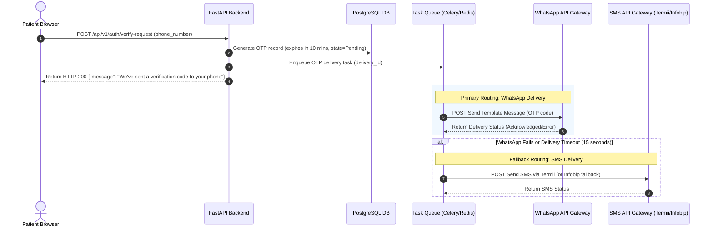

#### 4.6.2 Business Logic & Routing Policies
1. **WhatsApp-First Routing**: The system triggers verification alerts via the WhatsApp Business Cloud API.
2. **Automated SMS Fallback**: A task worker monitors the WhatsApp delivery status. If the WhatsApp message returns an error, if the destination number is not registered on WhatsApp, or if a delivery confirmation webhook is not received within **15 seconds** (configurable between 10-20s), the engine automatically fires the OTP via **Termii SMS** (or **Infobip** as a backup).
3. **UX Channel Abstraction**: The client UI remains channel-agnostic. It displays: `"We've sent a verification code to your phone."` hiding intermediate delivery transitions from patients.
4. **Active Session Tracking**: Only **one active OTP session** is permitted per phone number. A new OTP generation request invalidates all previously generated active codes for that number, preventing race conditions or dual-channel confusion.
5. **Security Constraints**:
   * **OTP Expiry**: Generated codes expire strictly after **10 minutes**.
   * **Single-Use**: Once a code is validated, it is flagged as `is_used = TRUE` and cannot be recycled.
   * **Rate Limiting**: IP and phone-number based rate limits (max 3 verification requests per phone number in 15 minutes) prevent SMS/WhatsApp spam and denial-of-wallet attacks.
   * **Retry Limits**: A maximum of 5 verification attempts are allowed per code. Exceeding this invalidates the OTP block and locks the session.
6. **Cost Optimization**: WhatsApp templates are billed per conversation, whereas SMS costs are per message segment. Prioritizing WhatsApp reduces expected messaging costs by an estimated 70-90% based on WhatsApp's high penetration rates in Nigeria.

---

## 5. Security Considerations

* **Role-Based Access Control (RBAC)**: Enforced via FastAPI security scopes. JWT tokens contain the user's role.
* **AWS KMS Key Policies**: Key access control is enforced via standard AWS KMS Key Policies. The KMS key policy explicitly restricts key actions (e.g., `kms:Decrypt` and `kms:Encrypt`) to the IAM role assigned to the backend application server instances. System and database administrators (even those with root IAM admin roles) are explicitly denied decrypt permissions on the key, securing clinical notes at rest.
* **Separation of Clinical Data (NFR-008)**: Administrators are granted system admin scopes allowing them to perform DB maintenance, but because they do not have IAM policies or KMS key policy permissions allowing Decrypt operations, they are cryptographically locked out from clinical logs.
* **Immutable Audit Trail**: Writing to clinical records automatically generates a non-nullable record in the `security_audit_logs` table within the same PostgreSQL transaction.
* **TLS 1.3**: All incoming client communication is locked to TLS 1.3 in transit.

---

## 6. Observability

* **Structured Logging**: All backend outputs use structured JSON logs containing a generated `correlation_id` header to trace API requests across background queues and database queries.
* **Search Latency Target**: Database query durations are logged to Datadog/CloudWatch; alarms trigger if search queries exceed 2.0s (NFR-001).
* **Delivery Logging**: The `NotificationLog` monitors notification metrics, calculating latency from appointment creation to notification delivery.

---

## 7. Rollout Plan

1. **Database Migration**: Schema creation using Alembic, executing backward-compatible modifications (e.g., adding nullable columns first, then populating values, and finally applying non-null constraints).
2. **PWA Rollout**: Static shell hosted on AWS S3/CloudFront behind a staging DNS domain.
3. **Phased Clinic Rollout**:
   * Week 1: Rollout system at Branch A (pilot branch).
   * Week 3: Rollout at Branch B.
   * Week 5: Rollout at Branch C.
4. **Offline Cache Validation**: Verify Service Worker routing rules during simulated workstation disconnections.

---

## 8. Resolved Decisions

| Question | Resolution | Decision Date | Architectural Impact |
|---|---|---|---|
| **OQ-001**: KMS Access Policies | Enforced via **standard AWS KMS Key Policies** scoped directly to the backend application server's IAM role. | 2026-06-04 | Simplifies deployment and local mock key testing. |
| **OQ-002**: OTP Route Channel | Implemented as a **hierarchical, WhatsApp-first verification flow** with automated **SMS fallback** (via Termii) on a 15-second delivery window timeout. | 2026-06-04 | Decreases SMS consumption costs while maintaining high-reliability delivery. |


--- WEB_GRAPH_CONTEXT.md ---
{
  "nodes": [],
  "edges": []
}
