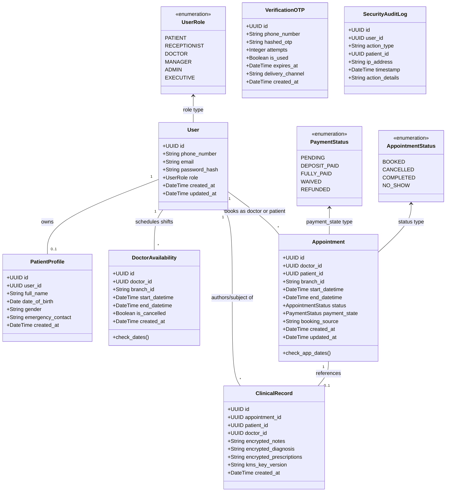
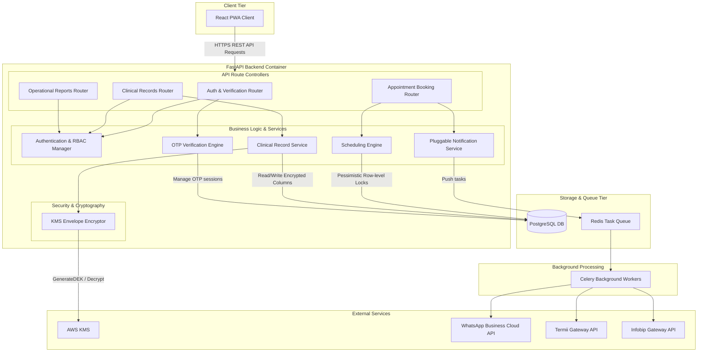
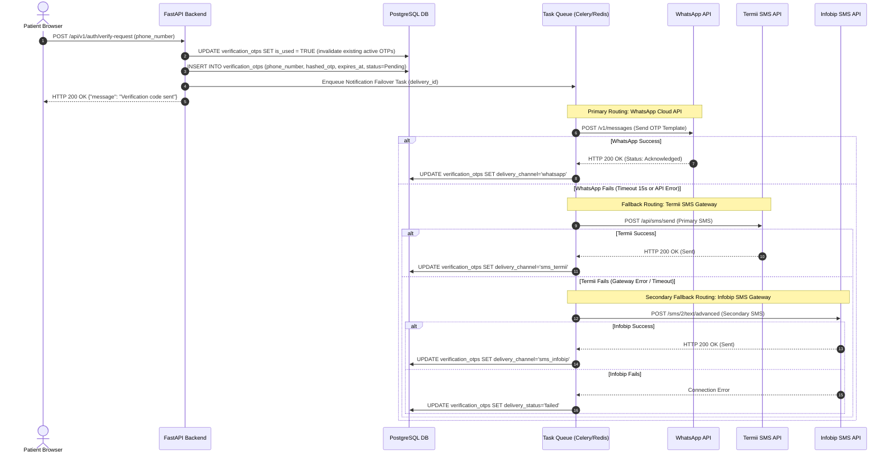
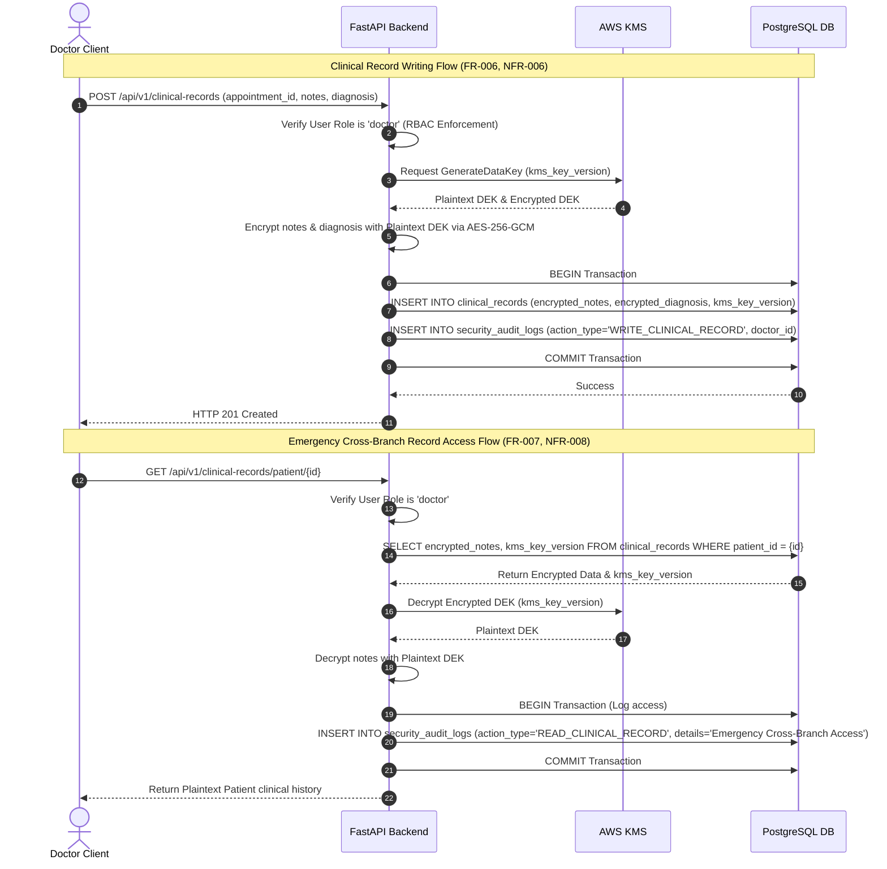
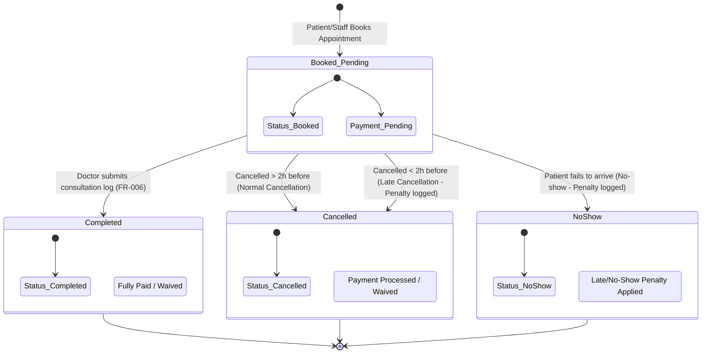
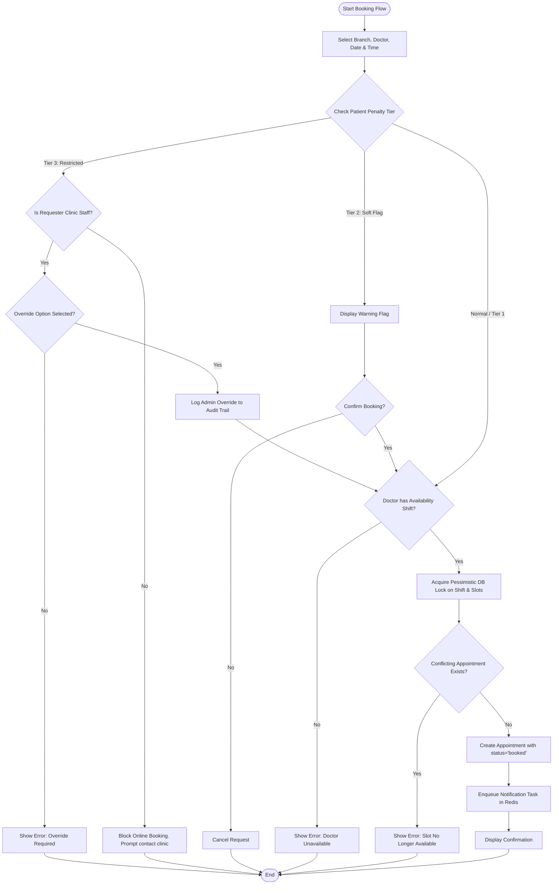
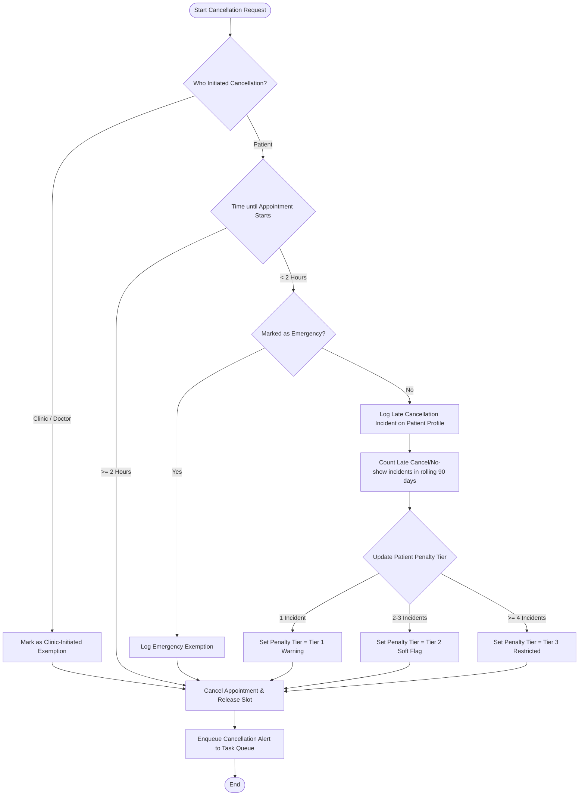

# Clinic Modernization Platform (CMP) — UML Design Models

This document presents the formal UML design models for the Clinic Modernization Platform (CMP). The diagrams are structured in **Mermaid** syntax, aligned with the platform's Software Requirements Document (SRD), Technical Specification, and Architecture Decision Records (ADRs).

***

## 1. Class Diagram (Static Entity Domain Model)

This diagram represents the database schema and system entities specified in **Section 4.2 (Data Model)** of the [Technical Specification](file:///C:/Users/DELL/Documents/Project/clinic_app_ase/technical_specification.md) and **DR-004** of the [Software Requirements Document](file:///C:/Users/DELL/Documents/Project/clinic_app_ase/software_requirements_document.md).



***

## 2. Component Diagram (FastAPI Backend Architecture)

Decomposes the logical architecture of the **FastAPI Container** based on **Level 3 Component Diagram** of the [C4 Architecture Models](file:///C:/Users/DELL/Documents/Project/clinic_app_ase/c4_architecture_models.md) and design choices in [ADR-003](file:///C:/Users/DELL/Documents/Project/clinic_app_ase/adr-003-application-level-column-encryption.md) and [ADR-004](file:///C:/Users/DELL/Documents/Project/clinic_app_ase/adr-004-pluggable-notification-failover.md).



***

## 3. Behavioral Sequence Diagrams

### 3.1 Doctor Shift Validation & Concurrent Booking (Pessimistic Locking)

Illustrates how the database pessimistic locking mechanism (**FR-019**, **NFR-001**) handles two concurrent requests trying to book the exact same doctor time-slot.

```mermaid
sequenceDiagram
    autonumber
    actor PatientA as Patient A Client
    actor PatientB as Patient B Client
    participant API as FastAPI Backend
    participant DB as PostgreSQL DB

    Note over PatientA, DB: Concurrent booking requests for Dr. X at Monday 9:00 AM
    PatientA->>API: POST /api/v1/appointments (Dr. X, 9:00 AM)
    PatientB->>API: POST /api/v1/appointments (Dr. X, 9:00 AM)

    critical Transaction A starts
        API->>DB: BEGIN Transaction A
        API->>DB: SELECT DoctorAvailability with_for_update() (Dr. X, Monday 9 AM - 9:30 AM)
        activate DB
        Note over DB: Lock acquired for Transaction A on DoctorAvailability row
    and Transaction B starts
        API->>DB: BEGIN Transaction B
        API->>DB: SELECT DoctorAvailability with_for_update() (Dr. X, Monday 9 AM - 9:30 AM)
        Note over DB: Transaction B BLOCKED, waiting for Lock on DoctorAvailability row
    end

    API->>DB: SELECT Appointments with_for_update() (Dr. X, Monday 9:00 AM)
    DB-->>API: No conflicting appointments found
    API->>DB: INSERT INTO appointments (Dr. X, Patient A, booked)
    API->>DB: COMMIT Transaction A
    deactivate DB
    Note over DB: Lock released. Transaction A committed.

    activate DB
    Note over DB: Transaction B unblocks, lock acquired by Transaction B
    DB-->>API: Returns DoctorAvailability shift data
    API->>DB: SELECT Appointments with_for_update() (Dr. X, Monday 9:00 AM)
    DB-->>API: Conflict found (Appointment for Patient A exists)
    API->>DB: ROLLBACK Transaction B
    deactivate DB
    Note over DB: Lock released. Transaction B rolled back.
    API-->>PatientA: HTTP 201 Created (Appointment ID)
    API-->>PatientB: HTTP 409 Conflict ("Slot is no longer available")
```

### 3.2 Hierarchical Verification & OTP Delivery Flow (WhatsApp-First, SMS Fallback)

Visualizes the multi-gateway verification flow (**OQ-002**, **INT-004**) attempting delivery via WhatsApp, falling back to local Termii SMS, and backing up to Infobip.



### 3.3 Clinical Consultation Logging & Audited Record Access

Represents the cryptographic workflow (**FR-006**, **FR-007**, **NFR-006**, **NFR-007**, **NFR-008**) for writing encrypted records and logging emergency overrides.



***

## 4. Entity Lifecycle State Diagrams

### 4.1 Appointment & Payment State Machine

Maps out status and payment transitions for the main scheduling unit (**DR-004**, **INT-005**).



### 4.2 Patient Penalty & Booking Restriction Lifecycle

Shows how late cancellations and no-shows affect patient booking permissions in rolling 90-day windows (**FR-012**, **FR-013**, **FR-014**).

```mermaid
stateDiagram-v2
    [*] --> Normal : New Patient Account Registered
    
    Normal --> Tier1_Warning : 1st Late Cancel / No-show
    Tier1_Warning --> Tier2_SoftFlag : 2nd-3rd Late Cancel / No-show
    Tier2_SoftFlag --> Tier3_Restricted : >= 4th Late Cancel / No-show

    Tier3_Restricted --> Tier2_SoftFlag : rolling 90 days elapse for older incidents
    Tier2_SoftFlag --> Tier1_Warning : rolling 90 days elapse for older incidents
    Tier1_Warning --> Normal : rolling 90 days elapse for older incidents

    state Normal {
        Note: Full self-service online booking enabled
    }
    state Tier1_Warning {
        Note: Warning banner shown on booking/cancellation screen
    }
    state Tier2_SoftFlag {
        Note: Soft flag on profile; requires confirmation to schedule
    }
    state Tier3_Restricted {
        Note: Online booking BLOCKED. Requires receptionist manual override.
    }
```

***

## 5. Activity Control Flow Diagrams

### 5.1 Booking Request & Restriction Validation Flow

Details the step-by-step control logic executed by the scheduling engine when a booking request arrives (**FR-003**, **FR-015**, **FR-019**).



### 5.2 Cancellation Penalty Engine Control Flow

Details the business rules processed by the system when an appointment is cancelled (**FR-012** to **FR-017**).


